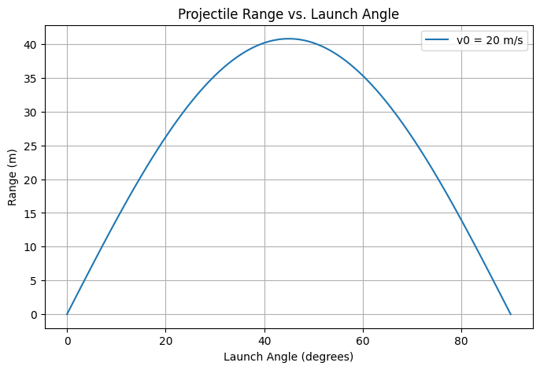
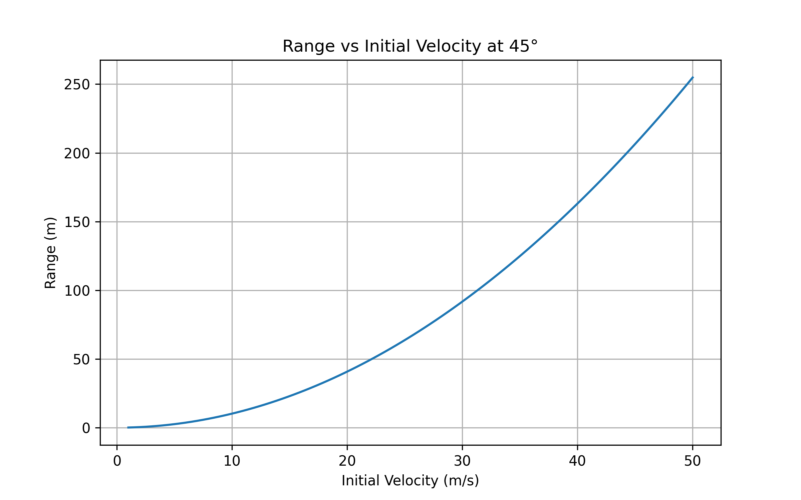

# Problem 1

## Projectile Motion: Analysis of Range Dependence on Launch Angle

### 1. Theoretical Foundation

Projectile motion is governed by Newton’s laws. Assuming no air resistance, the motion can be described using kinematic equations:

- **Horizontal motion:**

$$
x = v_0 \cos(\theta) \cdot t
$$

- **Vertical motion:**

$$
y = v_0 \sin(\theta) \cdot t - \frac{1}{2} g t^2
$$

The total time of flight is found by solving for when the projectile returns to its initial height:

$$
t_f = \frac{2 v_0 \sin(\theta)}{g}
$$

The horizontal range is given by:

$$
R = \frac{v_0^2 \sin(2\theta)}{g}
$$

---

### 2. Analysis of the Range

The horizontal range depends on:

- **Launch Angle (\(\theta\))**: The range is maximized at \( 45^\circ \).
- **Initial Velocity (\(v_0\))**: Higher velocity increases range quadratically.
- **Gravitational Acceleration (g):** A stronger gravitational field decreases range.

---

### 3. Practical Applications

- **Sports:** Understanding ball trajectories in football and basketball.
- **Engineering:** Designing projectile-based systems like rockets or artillery.
- **Astrophysics:** Studying planetary motion under different gravity levels.
- **Gymnastics:** I did gymnastics for about 4.5 years, and even though I stopped, I still remember how much things like angle and push-off mattered during flips and vaults. Now that I’m learning the physics behind it, it all makes a lot more sense.

---

### 4. Implementation: Python Simulation

We use Python to visualize how range varies with launch angle.

```python
import numpy as np
import matplotlib.pyplot as plt

def projectile_range(v0, g):
    angles = np.linspace(0, 90, 100)  # Angles in degrees
    angles_rad = np.radians(angles)   # Convert to radians
    ranges = (v0**2 * np.sin(2 * angles_rad)) / g

    plt.figure(figsize=(8,5))
    plt.plot(angles, ranges, label=f'v0 = {v0} m/s')
    plt.xlabel('Launch Angle (degrees)')
    plt.ylabel('Range (m)')
    plt.title('Projectile Range vs. Launch Angle')
    plt.legend()
    plt.grid()
    plt.show()

# Example parameters
v0 = 20  # Initial velocity in m/s
g = 9.81 # Gravity in m/s^2
projectile_range(v0, g)


#### Range at Selected Launch Angles

This graph shows how the horizontal range changes for selected launch angles (0°, 15°, ..., 90°).  
The range is maximized at 45°, and symmetric angles give equal ranges (like 30° and 60°).

```


#### Full Range vs. Launch Angle Plot

This plot provides a smoother, continuous look at how launch angle affects range.  
It complements the previous graph by showing the full curve instead of selected angles.



---

#### Range vs Initial Velocity at 45°

This graph shows how the range increases quadratically as the initial velocity increases, with a fixed launch angle of 45°.



```python
import numpy as np
import matplotlib.pyplot as plt

def range_vs_velocity(theta_deg, g):
    velocities = np.linspace(1, 50, 100)
    theta_rad = np.radians(theta_deg)
    ranges = (velocities**2 * np.sin(2 * theta_rad)) / g

    plt.figure(figsize=(8,5))
    plt.plot(velocities, ranges)
    plt.xlabel('Initial Velocity (m/s)')
    plt.ylabel('Range (m)')
    plt.title(f'Range vs Initial Velocity at {theta_deg}°')
    plt.grid()
    plt.savefig("range_vs_velocity.png", dpi=300)
    plt.show()

range_vs_velocity(45, 9.81)

```
---

### Gymnastics-Style Jump (Simplified Example)

```python
import math

# Gymnastics jump simulation
v0 = 4        # initial velocity (m/s)
angle = 50    # launch angle (degrees)
g = 9.81      # gravity (m/s^2)

theta = math.radians(angle)

t = (2 * v0 * math.sin(theta)) / g
R = (v0**2 * math.sin(2 * theta)) / g

print("Time in air:", round(t, 2), "s")
print("Distance:", round(R, 2), "m")

# Calculate maximum height
h_max = (v0**2 * math.sin(theta)**2) / (2 * g)
print("Maximum height:", round(h_max, 2), "m")
```


This is a short example of how angle and velocity affect the flight time and distance of a jump, like in gymnastics.

---

### 5. Discussion on Limitations

- **Air Resistance:** In real scenarios, drag significantly reduces range.
- **Uneven Terrain:** Changes in landing elevation affect results.
- **Wind Influence:** Can alter trajectory unpredictably.

---
### 6. Examples

  
*Figure 1: Illustration showing how launch angle and velocity affect the range of projectile motion.*

  
*Figure 2: Simulated projectile paths at 45° launch angle with different initial velocities.*

### Conclusion

This analysis demonstrates the relationship between launch angle and range, emphasizing its significance in various real-world applications. It also helped me connect what I’m learning now to the years I spent doing gymnastics. Future studies can include more realistic factors like air resistance and body posture during motion.
