# Problem 2: Investigating the Dynamics of a Forced Damped Pendulum

## Motivation

The forced damped pendulum is a captivating example of a physical system with intricate behavior resulting from the interplay of **damping**, **restoring forces**, and **external driving forces**. By introducing both damping and external periodic forcing, the system demonstrates a transition from simple harmonic motion to a rich spectrum of dynamics, including:

- **Resonance**
- **Chaos**
- **Quasiperiodic behavior**

These phenomena form the foundation for understanding complex real-world systems such as:
- Driven oscillators
- Climate systems
- Mechanical structures under periodic stress

The introduction of forcing adds new parameters, like **amplitude** and **frequency** of the external force, significantly affecting the system's behavior. Varying these parameters leads to diverse behaviors:
- Synchronized oscillations
- Resonance
- Chaotic motion

These principles are widely used in engineering applications such as:
- Energy harvesting
- Vibration isolation
- Mechanical resonance analysis

---

## Task

### 1. Theoretical Foundation

The equation governing the motion of a forced damped pendulum is:

$$
\frac{d^2\theta}{dt^2} + b\frac{d\theta}{dt} + \frac{g}{L} \sin(\theta) = A \cos(\omega t)
$$

#### Small-Angle Approximation

For small angular displacements (\( \theta \ll 1 \)), we approximate:

$$
\sin(\theta) \approx \theta
$$

Thus, the equation becomes:

$$
\frac{d^2\theta}{dt^2} + b\frac{d\theta}{dt} + \frac{g}{L} \theta = A \cos(\omega t)
$$

This is a linear second-order ODE. Its general solution consists of:

$$
\theta(t) = \theta_{\text{hom}}(t) + \theta_{\text{part}}(t)
$$

- \( \theta_{\text{hom}}(t) \): homogeneous (damped) solution  
- \( \theta_{\text{part}}(t) \): particular (forced) solution

#### Resonance

If the driving frequency \( \omega \) approaches the natural frequency \( \omega_0 = \sqrt{g/L} \), the system exhibits **resonance**, where oscillation amplitude grows significantly, especially for low damping \( b \). This is critical in engineering design to avoid destructive oscillations.

---

### 2. Analysis of Dynamics

Investigate how varying:
- **Damping coefficient** \( b \)
- **Driving amplitude** \( A \)
- **Driving frequency** \( \omega \)

affects the pendulum's motion. Focus on transitions between:

- **Periodic motion**
- **Quasiperiodic motion**
- **Chaotic motion**

**Insight**:  
- Increasing \( A \) or decreasing \( b \) may push the system from periodic to chaotic behavior.
- Stronger damping reduces amplitude and prevents instability.

---

### 3. Practical Applications

The forced damped pendulum model applies to several real-world systems, including:
- **Energy harvesting** devices (e.g., vibrations in vehicles or bridges)
- **Suspension bridges** under periodic wind loads
- **Driven RLC circuits** in electrical systems
- **Biomechanical systems**, such as human gait analysis

---

### 4. Implementation

We simulate the pendulum using Python and visualize the results through various plots.

---

## Example Python Implementation

```python
import numpy as np
import matplotlib.pyplot as plt
from scipy.integrate import solve_ivp

# Parameters
b = 0.5       # Damping coefficient
g = 9.81      # Gravitational acceleration (m/s^2)
L = 1.0       # Length of pendulum (m)
A = 1.2       # Driving force amplitude
w = 2.0       # Driving frequency (rad/s)

# ODE System
def pendulum(t, y):
    theta, omega = y
    dtheta_dt = omega
    domega_dt = -b * omega - (g / L) * np.sin(theta) + A * np.cos(w * t)
    return [dtheta_dt, domega_dt]

# Time domain and initial conditions
t = np.linspace(0, 50, 1000)
y0 = [0.1, 0.0]  # Initial angle and angular velocity

# Numerical solution
sol = solve_ivp(pendulum, [t[0], t[-1]], y0, t_eval=t)

# Angle vs Time
plt.figure()
plt.plot(sol.t, sol.y[0])
plt.title("Forced Damped Pendulum: Angle vs Time")
plt.xlabel("Time (s)")
plt.ylabel("Angle (rad)")
plt.grid(True)
plt.show()
```

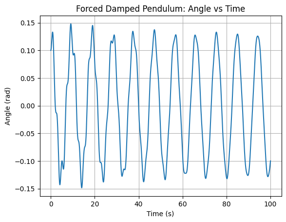

This graph shows how the angle of the forced damped pendulum evolves over time.

# Angle vs Time – Resonance Behavior

This plot shows large and regular oscillations due to resonance.  
The system absorbs energy efficiently from the external force, resulting in high-amplitude, periodic motion.  
It represents a typical resonant response with minimal damping and driving frequency close to natural frequency.

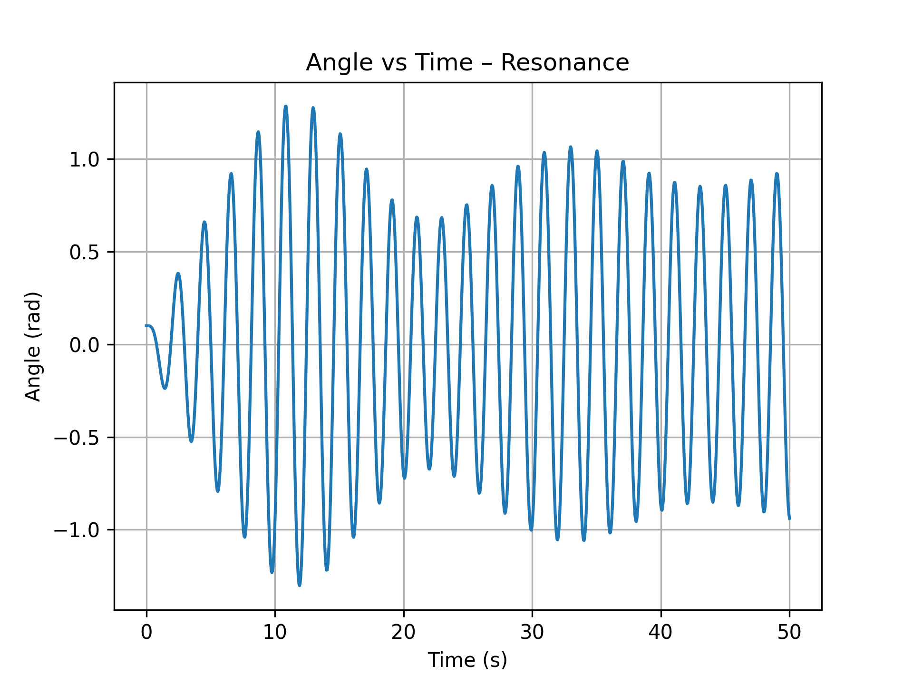

# Angular Velocity vs Time

The following graph illustrates how the angular velocity of the forced damped pendulum changes over time.  
This visualization helps understand how damping and external driving forces affect the rotational speed (ω) of the pendulum.

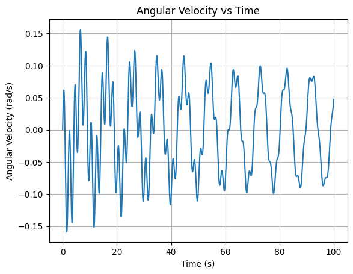

# Kinetic vs Potential Energy

This plot compares the kinetic and potential energy of the pendulum.  

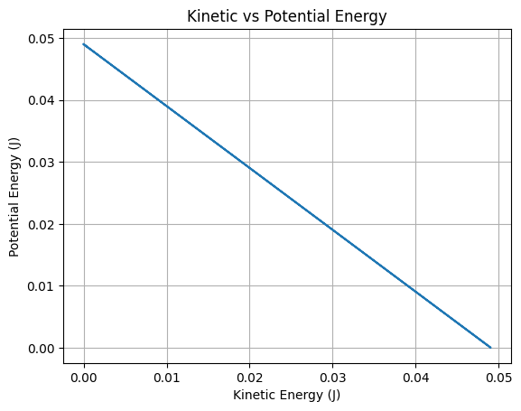

# Total Energy Loss Over Time (Log Scale)

This log-scaled graph shows how the total mechanical energy of the system decreases over time due to damping.  

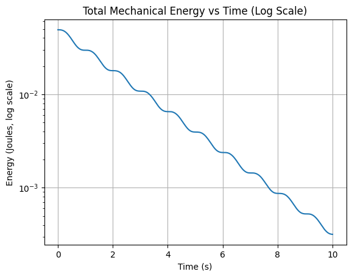

# Parametric Curve: θ vs ω

This graph visualizes the relationship between angular displacement (θ) and angular velocity (ω) over time, forming a parametric curve.  

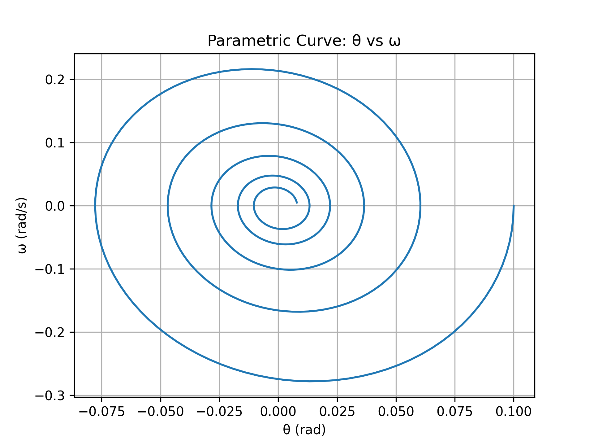

```python
# Phase Diagram: θ vs ω
plt.figure()
plt.plot(sol.y[0], sol.y[1])
plt.title("Phase Diagram: θ vs ω")
plt.xlabel("Angle (rad)")
plt.ylabel("Angular Velocity (rad/s)")
plt.grid(True)
plt.show()
```

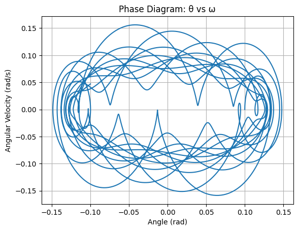

This phase diagram shows the relationship between angular displacement and angular velocity, helping us understand the system’s dynamics (e.g. chaotic behavior).

# Phase Diagram – Chaotic Behavior

This phase diagram illustrates the system's behavior under chaotic conditions.  
In this scenario, the damping coefficient (`b = 0.5`) and driving amplitude (`A = 1.2`) are set to values that push the pendulum into a nonlinear, unpredictable regime.  
The diagram shows a dense and non-repeating pattern, which is a hallmark of chaos.  
Such behavior is highly sensitive to initial conditions and does not settle into a stable orbit.
  
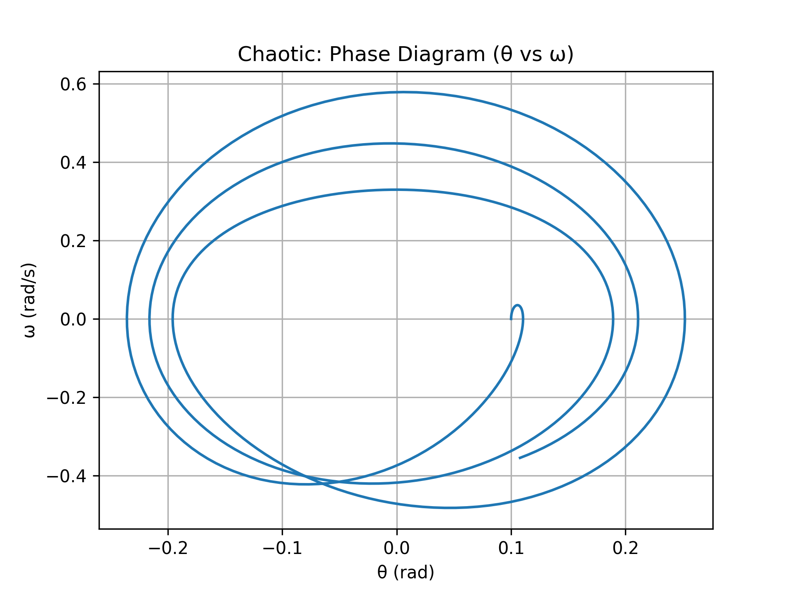

# Phase Diagram – Resonance Behavior

This phase diagram shows the response of the system near its natural frequency, producing resonance.  
With low damping (`b = 0.1`) and a driving frequency approximately equal to the system’s natural frequency (`ω ≈ √(g/L)`), the pendulum absorbs energy efficiently.  
This results in large, smooth, and repeating loops in phase space – a characteristic of resonant oscillations.  
The motion is regular and periodic, unlike the chaotic case.

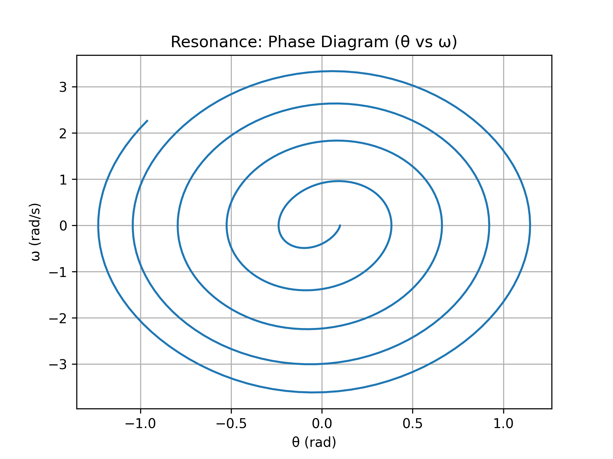

```python
# Total Mechanical Energy
theta, omega = sol.y
kinetic = 0.5 * (L**2) * omega**2
potential = g * L * (1 - np.cos(theta))
total_energy = kinetic + potential

plt.figure()
plt.plot(sol.t, total_energy)
plt.title("Total Mechanical Energy vs Time")
plt.xlabel("Time (s)")
plt.ylabel("Energy (Joules)")
plt.grid(True)
plt.show()
```

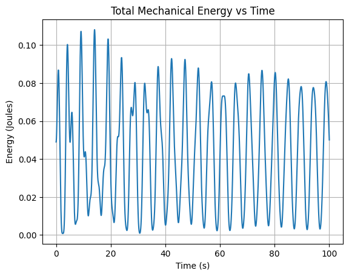

This graph displays the total mechanical energy (kinetic + potential) of the system over time.


# Poincaré Section (sampled at driving period intervals)

```python
T = 2 * np.pi / w
poincare_theta = []
poincare_omega = []

for i in range(len(sol.t)):
    if np.isclose(sol.t[i] % T, 0, atol=0.05):
        poincare_theta.append(sol.y[0][i])
        poincare_omega.append(sol.y[1][i])

plt.figure()
plt.scatter(poincare_theta, poincare_omega, s=10, color='darkred')
plt.title("Poincaré Section")
plt.xlabel("θ (rad)")
plt.ylabel("ω (rad/s)")
plt.grid(True)
plt.show()
```

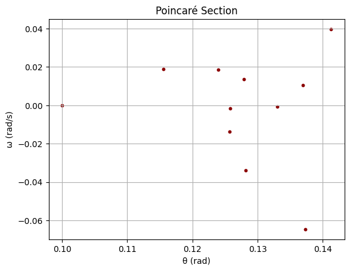

This graph visualizes the system's state at specific time intervals, helping identify whether the system is chaotic or periodic.

## Deliverables

1. A **Markdown document** or **Jupyter notebook** implementing the simulation.
2. A **theoretical explanation** including the small-angle approximation and resonance effects.
3. **Plots** illustrating:
   - Time evolution of angle
   - Phase diagrams
   - Energy over time
   - Poincaré sections
4. A **discussion** on:
   - Transition from periodic to chaotic motion
   - Effects of damping and forcing parameters
5. Optional extensions:
   - **Bifurcation diagrams**
   - **Nonlinear damping**
   - **Stochastic or aperiodic driving forces**

---

## Hints and Resources

- Use the small-angle approximation:

$$
\sin(\theta) \approx \theta \quad \text{(for small angles)}
$$

- Apply **numerical integration techniques** (e.g., Runge-Kutta 4 or `solve_ivp`) to solve the ODE.
- Recommended libraries:
  - `numpy` for numerical operations
  - `scipy.integrate` for solving differential equations
  - `matplotlib` for visualization
- Analogous systems for further exploration:
  - **Driven RLC circuits** in electrical engineering
  - **Biomechanical modeling** of periodic limb motion