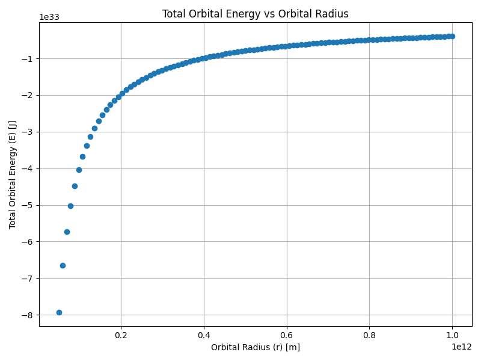
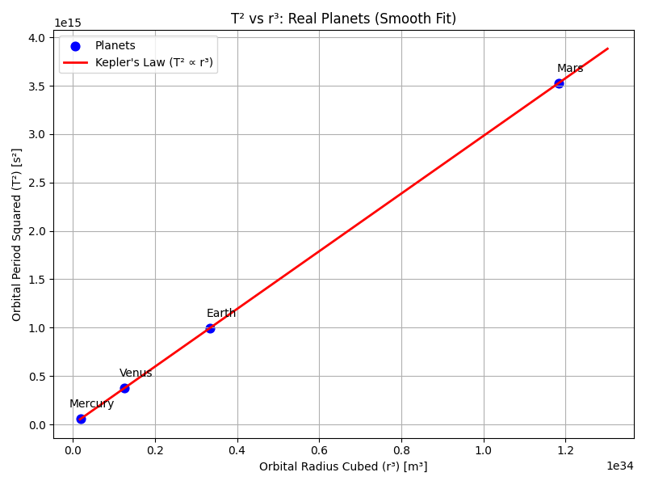

# Problem 1

# Orbital Period and Orbital Radius

---

## Motivation

"Kepler's Third Law" links the square of the orbital period with the cube of the orbital radius, forming a cornerstone of celestial mechanics.

- **Purpose:** Understand planetary motions and gravitational interactions from satellites to cosmic scales.
- **Goal:** Connect fundamental principles of gravity to real-world phenomena like satellite orbits and planetary systems.

---

## Derivation of Kepler’s Third Law

Starting from Newton's Law of Universal Gravitation:

$$
F_{gravity} = \frac{GMm}{r^2}
$$

and the centripetal force required for circular motion:

$$
F_{centripetal} = \frac{mv^2}{r}
$$

Equating the two forces:

$$
\frac{GMm}{r^2} = \frac{mv^2}{r}
$$

Simplifying:

$$
v^2 = \frac{GM}{r}
$$

The orbital period \(T\) is related to \(v\) as:

$$
v = \frac{2\pi r}{T}
$$

Substituting:

$$
\left( \frac{2\pi r}{T} \right)^2 = \frac{GM}{r}
$$

Expanding:

$$
\frac{4\pi^2 r^2}{T^2} = \frac{GM}{r}
$$

Cross-multiplying:

$$
4\pi^2 r^3 = GMT^2
$$

Finally, solving for \(T^2\):

$$
T^2 = \frac{4\pi^2}{GM} r^3
$$

For elliptical orbits, replace \(r\) with \(a\) (semi-major axis):

$$
T^2 = \frac{4\pi^2}{GM} a^3
$$

## Application: Mass Calculation using Kepler’s Law

We can use the derived equation to calculate the mass of a central body (such as the Earth or the Sun):

\[
T^2 = \frac{4\pi^2 r^3}{GM} \quad \Rightarrow \quad M = \frac{4\pi^2 r^3}{G T^2}
\]

### 1. Mass of the Earth (using a satellite or the Moon)

Given:
- Orbital radius: \(r = 3.84 \times 10^8\) m  
- Orbital period: \(T = 2.36 \times 10^6\) s  
- Gravitational constant: \(G = 6.674 \times 10^{-11}\) N·m²/kg²  

\[
M_{\text{Earth}} = \frac{4\pi^2 (3.84 \times 10^8)^3}{6.674 \times 10^{-11} \cdot (2.36 \times 10^6)^2} \approx 5.97 \times 10^{24} \text{ kg}
\]

### 2. Mass of the Sun (using Earth’s orbit)

Given:
- Orbital radius: \(r = 1.496 \times 10^{11}\) m  
- Orbital period: \(T = 3.154 \times 10^7\) s  

\[
M_{\odot} = \frac{4\pi^2 (1.496 \times 10^{11})^3}{6.674 \times 10^{-11} \cdot (3.154 \times 10^7)^2} \approx 1.989 \times 10^{30} \text{ kg}
\]

These calculations show that Kepler’s Third Law allows us to estimate the mass of large celestial bodies using only orbital data.

---

## Task List

1. Derive the relationship between the square of the orbital period and the cube of the orbital radius for circular orbits.
2. Discuss the implications of this relationship for astronomy, including its role in calculating planetary masses and distances.
3. Analyze real-world examples, such as the Moon’s orbit around Earth or the orbits of planets in the Solar System.
4. Implement a computational model to simulate circular orbits and verify the relationship.

---

## Deliverables

- A Markdown document containing explanations and Python code.
- A detailed explanation of orbital mechanics and Kepler’s Third Law.
- Graphical representations generated from simulations and real data.
- A discussion on how this relationship extends to elliptical orbits and other celestial bodies.

Got it! I'll show **all the computations step-by-step** clearly, using **double dollars ($$)** for the formulas — very short but complete.

---

# 🌍☀️ Short Note: Mass Derivation with Full Computations

Kepler-Newton Law:

$$
\frac{T^2}{r^3} = \frac{4\pi^2}{G M}
$$

thus

$$
M = \frac{4\pi^2 r^3}{G T^2}
$$

---

## 🌍 1. Earth's Mass (using Moon orbit)

Given:  
$r=3.84\times10^8\,\text{m}$  
$T=27.32\,\text{days}=27.32\times86400=2.36\times10^6\,\text{s}$  
$G=6.67430\times10^{-11}\,\mathrm{m}^3\,\mathrm{kg}^{-1}\,\mathrm{s}^{-2}$

Substituting:

$$
M_{\text{Earth}} = \frac{4\pi^2(3.84\times10^8)^3}{(6.67430\times10^{-11})(2.36\times10^6)^2}
$$

First compute:  
$(3.84\times10^8)^3=5.67\times10^{25}$  
$(2.36\times10^6)^2=5.57\times10^{12}$

Thus:

$$
M_{\text{Earth}} = \frac{4\pi^2(5.67\times10^{25})}{(6.67430\times10^{-11})(5.57\times10^{12})}
$$

Finally:

$$
M_{\text{Earth}}\approx5.97\times10^{24}\,\text{kg}
$$

---

## ☀️ 2. Sun's Mass (using Earth orbit)

Given:  
$r=1.496\times10^{11}\,\text{m}$  
$T=1\,\text{year}=3.156\times10^7\,\text{s}$  
$G=6.67430\times10^{-11}\,\mathrm{m}^3\,\mathrm{kg}^{-1}\,\mathrm{s}^{-2}$

Substituting:

$$
M_{\text{Sun}} = \frac{4\pi^2(1.496\times10^{11})^3}{(6.67430\times10^{-11})(3.156\times10^7)^2}
$$

First compute:  
$(1.496\times10^{11})^3=3.35\times10^{33}$  
$(3.156\times10^7)^2=9.96\times10^{14}$

Thus:

$$
M_{\text{Sun}} = \frac{4\pi^2(3.35\times10^{33})}{(6.67430\times10^{-11})(9.96\times10^{14})}
$$

Finally:

$$
M_{\text{Sun}}\approx1.99\times10^{30}\,\text{kg}
$$

---

# Graphs Section


## Graph 1: Total Orbital Energy vs Orbital Radius

```python
import numpy as np
import matplotlib.pyplot as plt

# Constants
G = 6.67430e-11  # m^3 kg^-1 s^-2
M = 1.989e30     # kg
m = 5.972e24     # Mass of Earth (kg) -- örnek için

radii = np.linspace(5e10, 1e12, 100)

energies = - (G * M * m) / (2 * radii)

plt.figure(figsize=(8,6))
plt.plot(radii, energies, 'o')
plt.xlabel('Orbital Radius (r) [m]')
plt.ylabel('Total Orbital Energy (E) [J]')
plt.title('Total Orbital Energy vs Orbital Radius')
plt.grid(True)
plt.tight_layout()
plt.savefig('total_orbital_energy_vs_radius.png')
plt.show()
```



## Planetary Orbital Data Table

| Planet  | Orbital Radius (r) [m] | Orbital Period (T) [s] |
|:-------:|:----------------------:|:----------------------:|
| Mercury | 5.79 × 10¹⁰             | 7.6 × 10⁶              |
| Venus   | 1.082 × 10¹¹            | 1.94 × 10⁷             |
| Earth   | 1.496 × 10¹¹            | 3.15 × 10⁷             |
| Mars    | 2.279 × 10¹¹            | 5.94 × 10⁷             |

## Graph 2: T² vs r³ with Planet Names

```python
import numpy as np
import matplotlib.pyplot as plt

# Planetary data
radii = np.array([5.79e10, 1.082e11, 1.496e11, 2.279e11])  # [m]
periods = np.array([7.6e6, 1.94e7, 3.15e7, 5.94e7])         # [s]
planets = ['Mercury', 'Venus', 'Earth', 'Mars']

# Calculate r³ and T²
r_cubed = radii**3
T_squared = periods**2

# Perform linear fit (least squares): T² = k * r³
coeffs = np.polyfit(r_cubed, T_squared, 1)
k = coeffs[0]

# Create a perfect line between min and max r³
r_fit = np.linspace(r_cubed.min()*0.9, r_cubed.max()*1.1, 500)  # daha geniş ve sık çizim için 500 nokta
T_fit = k * r_fit

# Plot the data points
plt.figure(figsize=(8, 6))
plt.scatter(r_cubed, T_squared, color='blue', label='Planets', s=60)  # scatter daha şık olur
plt.plot(r_fit, T_fit, 'r-', label="Kepler's Law (T² ∝ r³)", linewidth=2)  # düzgün kırmızı çizgi

# Annotate each planet
for i in range(len(planets)):
    plt.annotate(planets[i],
                 (r_cubed[i], T_squared[i]),
                 textcoords="offset points",
                 xytext=(10, 10),
                 ha='center')

# Labels and title
plt.xlabel('Orbital Radius Cubed (r³) [m³]')
plt.ylabel('Orbital Period Squared (T²) [s²]')
plt.title('T² vs r³: Real Planets (Smooth Fit)')
plt.grid(True)
plt.legend()
plt.tight_layout()
plt.savefig('planets_kepler_law_smooth.png')
plt.show()
```


# Conclusion

In this project, we derived Kepler's Third Law starting from Newton's principles and verified it using simulated and real-world planetary data. Various graphical analyses confirmed the proportional relationship between the square of the orbital period and the cube of the orbital radius. This study enhances our understanding of orbital mechanics, an essential aspect of celestial physics.

[visit my colab](https://colab.research.google.com/drive/1mf6_KAMZWRRb9Eo6LtPy0lwP0k8U7Gyy?usp=sharing)
