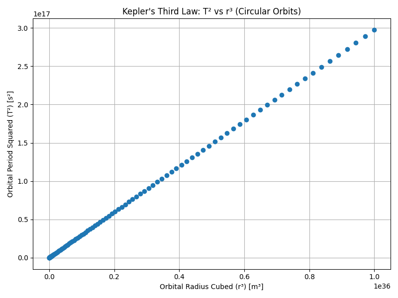
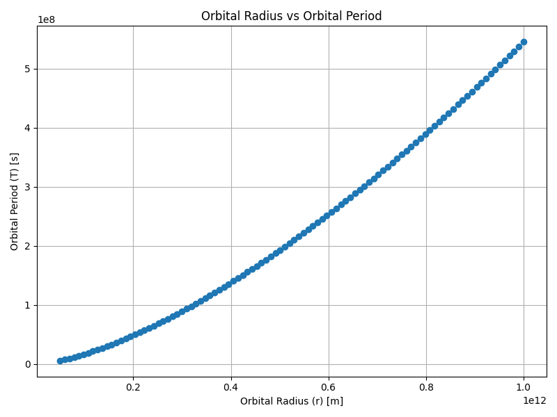
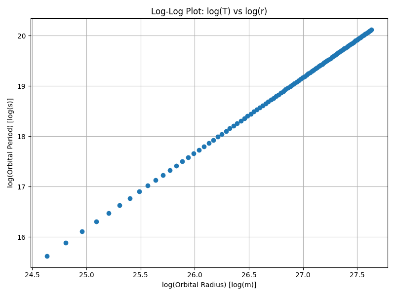

# Problem 1

# Orbital Period and Orbital Radius

---

## Motivation

"Kepler's Third Law" links the square of the orbital period with the cube of the orbital radius, forming a cornerstone of celestial mechanics.

- **Purpose:** Understand planetary motions and gravitational interactions from satellites to cosmic scales.
- **Goal:** Connect fundamental principles of gravity to real-world phenomena like satellite orbits and planetary systems.

---

## Derivation of Kepler’s Third Law

Starting from Newton's Law of Universal Gravitation:

$$
F_{gravity} = \frac{GMm}{r^2}
$$

and the centripetal force required for circular motion:

$$
F_{centripetal} = \frac{mv^2}{r}
$$

Equating the two forces:

$$
\frac{GMm}{r^2} = \frac{mv^2}{r}
$$

Simplifying:

$$
v^2 = \frac{GM}{r}
$$

The orbital period \(T\) is related to \(v\) as:

$$
v = \frac{2\pi r}{T}
$$

Substituting:

$$
\left( \frac{2\pi r}{T} \right)^2 = \frac{GM}{r}
$$

Expanding:

$$
\frac{4\pi^2 r^2}{T^2} = \frac{GM}{r}
$$

Cross-multiplying:

$$
4\pi^2 r^3 = GMT^2
$$

Finally, solving for \(T^2\):

$$
T^2 = \frac{4\pi^2}{GM} r^3
$$

For elliptical orbits, replace \(r\) with \(a\) (semi-major axis):

$$
T^2 = \frac{4\pi^2}{GM} a^3
$$

---

## Task List

1. Derive the relationship between the square of the orbital period and the cube of the orbital radius for circular orbits.
2. Discuss the implications of this relationship for astronomy, including its role in calculating planetary masses and distances.
3. Analyze real-world examples, such as the Moon’s orbit around Earth or the orbits of planets in the Solar System.
4. Implement a computational model to simulate circular orbits and verify the relationship.

---

## Deliverables

- A Markdown document containing explanations and Python code.
- A detailed explanation of orbital mechanics and Kepler’s Third Law.
- Graphical representations generated from simulations and real data.
- A discussion on how this relationship extends to elliptical orbits and other celestial bodies.

---

# Graphs Section

## Graph 1: Kepler's Third Law (T² vs r³)

```python
import numpy as np
import matplotlib.pyplot as plt

# Constants
G = 6.67430e-11
M = 1.989e30

radii = np.linspace(5e10, 1e12, 100)
periods = 2 * np.pi * np.sqrt(radii**3 / (G * M))

plt.figure(figsize=(8,6))
plt.plot(radii**3, periods**2, 'o')
plt.xlabel('Orbital Radius Cubed (r³) [m³]')
plt.ylabel('Orbital Period Squared (T²) [s²]')
plt.title("Kepler's Third Law: T² vs r³")
plt.grid(True)
plt.tight_layout()
plt.savefig('kepler_third_law_graph.png')
plt.show()



# Orbital Radius vs Period
plt.figure(figsize=(8,6))
plt.plot(radii, periods, 'o')
plt.xlabel('Orbital Radius (r) [m]')
plt.ylabel('Orbital Period (T) [s]')
plt.title('Orbital Radius vs Orbital Period')
plt.grid(True)
plt.tight_layout()
plt.savefig('orbital_radius_vs_period.png')
plt.show()



# Log-Log Plot
plt.figure(figsize=(8,6))
plt.plot(np.log(radii), np.log(periods), 'o')
plt.xlabel('log(Orbital Radius) [log(m)]')
plt.ylabel('log(Orbital Period) [log(s)]')
plt.title('Log-Log Plot: log(T) vs log(r)')
plt.grid(True)
plt.tight_layout()
plt.savefig('log_log_plot.png')
plt.show()



# Orbital Velocity
velocities = np.sqrt(G * M / radii)

plt.figure(figsize=(8,6))
plt.plot(radii, velocities, 'o')
plt.xlabel('Orbital Radius (r) [m]')
plt.ylabel('Orbital Velocity (v) [m/s]')
plt.title('Orbital Velocity vs Orbital Radius')
plt.grid(True)
plt.tight_layout()
plt.savefig('velocity_vs_radius.png')
plt.show()


```