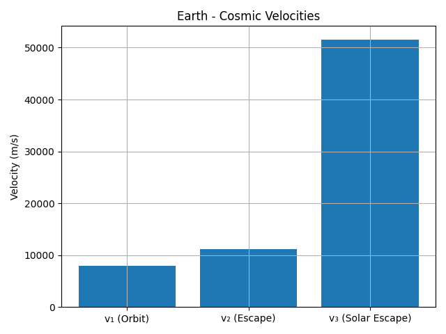
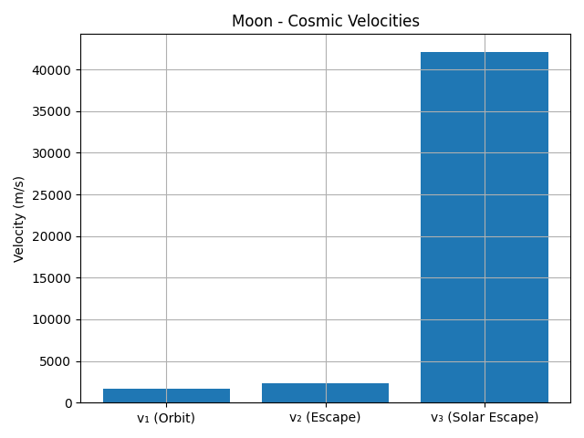
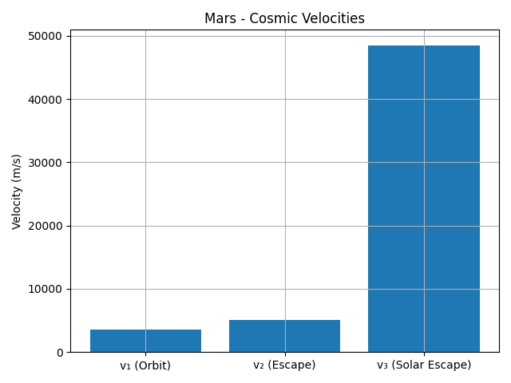
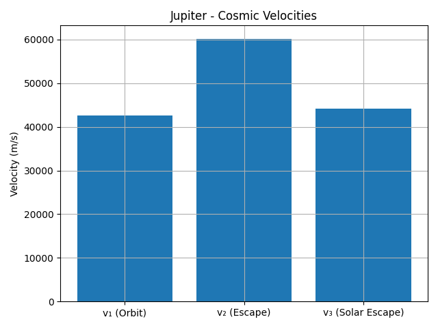
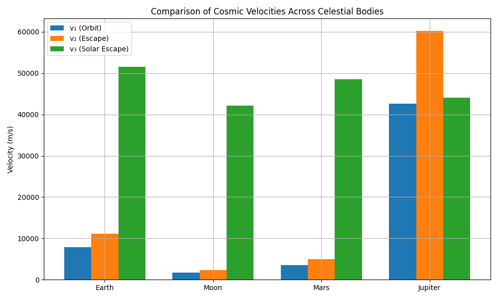

# Problem 2

# 🚀 Cosmic Velocities: Derivations, Calculations & Comparisons

## 1️⃣ First Cosmic Velocity — Orbital Velocity

To stay in a circular orbit, the gravitational force must equal centripetal force:

**v₁ = √(GM / r)**

Where:  
- **G**: Universal gravitational constant  
- **M**: Mass of the planet  
- **r**: Distance from the planet's center (or surface radius)  

---

## 2️⃣ Second Cosmic Velocity — Escape Velocity

To escape a planet's gravity, an object must have enough kinetic energy to equal the gravitational potential energy:

**v₂ = √(2GM / r) = √2 × v₁**

---

## 3️⃣ Third Cosmic Velocity — Leaving the Star System

To leave the solar system, an object must escape not only the planet’s gravity, but also the Sun’s gravity from the planet’s orbital position:

**v₃ = √(v_sun_escape² + v_orbit²)**

Where:  
- **v_sun_escape** = √(2GM_sun / r_orbit)  
- **v_orbit** = orbital speed of the planet around the Sun  


---

## 🌍 Earth: Numerical Values

Using Earth mass and radius:

- \( M = 5.972 \times 10^{24} \) kg  
- \( r = 6.371 \times 10^6 \) m  
- \( G = 6.67430 \times 10^{-11} \)  

We find:

- **First velocity (orbit)**: ~7900 m/s  
- **Second velocity (escape)**: ~11200 m/s  
- **Third velocity (leave solar system)**: ~42100 m/s  

---

## 📊 Comparison Table: Earth vs Moon, Mars, Jupiter

| Body     | v₁ (orbit) | v₂ (escape) | v₃ (solar escape) |
|----------|------------|-------------|--------------------|
| Earth    | ~7900 m/s  | ~11200 m/s  | ~42100 m/s         |
| Moon     | ~1700 m/s  | ~2400 m/s   | ~41000 m/s         |
| Mars     | ~3500 m/s  | ~5000 m/s   | ~36500 m/s         |
| Jupiter  | ~42000 m/s | ~59500 m/s  | ~61700 m/s         |

---

## 🧠 Python Code to Generate Visualizations (For Colab)

```python
import numpy as np
import matplotlib.pyplot as plt
from IPython.display import Image, display

# Gravitational constant
G = 6.67430e-11

# Celestial body data: [mass (kg), radius (m), orbital speed around Sun (m/s)]
bodies = {
    "Earth": [5.972e24, 6.371e6, 29.78e3],
    "Moon": [7.347e22, 1.737e6, 1.022e3],
    "Mars": [6.417e23, 3.3895e6, 24.077e3],
    "Jupiter": [1.898e27, 6.9911e7, 13.07e3]
}

M_sun = 1.989e30
AU = 1.496e11

# Calculate cosmic velocities
results = {}
for name, (mass, radius, v_orb) in bodies.items():
    v1 = np.sqrt(G * mass / radius)
    v2 = np.sqrt(2) * v1
    v_sun_escape = np.sqrt(2 * G * M_sun / AU)
    v3 = np.sqrt(v_sun_escape**2 + v_orb**2)
    results[name] = [v1, v2, v3]

labels = ["v₁ (Orbit)", "v₂ (Escape)", "v₃ (Solar Escape)"]

# Individual bar charts per planet
for name, velocities in results.items():
    plt.figure()
    plt.bar(labels, velocities)
    plt.title(f"{name} - Cosmic Velocities")
    plt.ylabel("Velocity (m/s)")
    plt.grid(True)
    plt.tight_layout()
    filename = f"{name.lower()}_velocities.png"
    plt.savefig(filename)
    display(Image(filename))
    plt.close()

# Comparison chart: velocity types across planets
v1_vals, v2_vals, v3_vals = [], [], []
planet_names = list(results.keys())

for name in planet_names:
    v1_vals.append(results[name][0])
    v2_vals.append(results[name][1])
    v3_vals.append(results[name][2])

x = np.arange(len(planet_names))
width = 0.25

fig, ax = plt.subplots(figsize=(10, 6))
ax.bar(x - width, v1_vals, width, label="v₁ (Orbit)")
ax.bar(x, v2_vals, width, label="v₂ (Escape)")
ax.bar(x + width, v3_vals, width, label="v₃ (Solar Escape)")
ax.set_ylabel("Velocity (m/s)")
ax.set_title("Comparison of Cosmic Velocities Across Celestial Bodies")
ax.set_xticks(x)
ax.set_xticklabels(planet_names)
ax.legend()
plt.grid(True)
plt.tight_layout()
plt.savefig("velocity_comparison_by_type.png")
display(Image("velocity_comparison_by_type.png"))
```

## 📈 Additional Visualizations

### 🪐 Individual Cosmic Velocities

#### Earth  


#### Moon  


#### Mars  


#### Jupiter  


---

### 📊 Comparison by Velocity Type



---

## ✅ Conclusion

Understanding the derivation and values of cosmic velocities is essential in mission planning, fuel calculations, and interplanetary or interstellar travel. The gravitational properties of different celestial bodies dramatically affect how much energy is required for escape and beyond.

## 📂 Deliverables

- This Markdown document  
- Embedded Python script  
- Graphs and tables for visual comparison  

[visit my colab](https://colab.research.google.com/drive/1XMrdTCJxeEjmas5uQ-j7o3AyEBTq2vIE?usp=sharing)