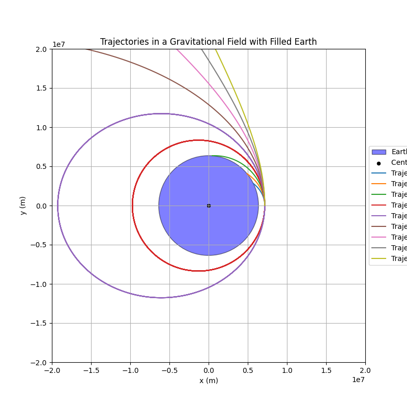
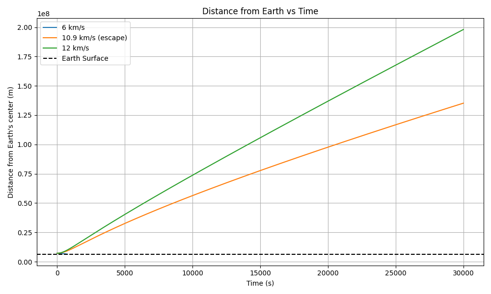
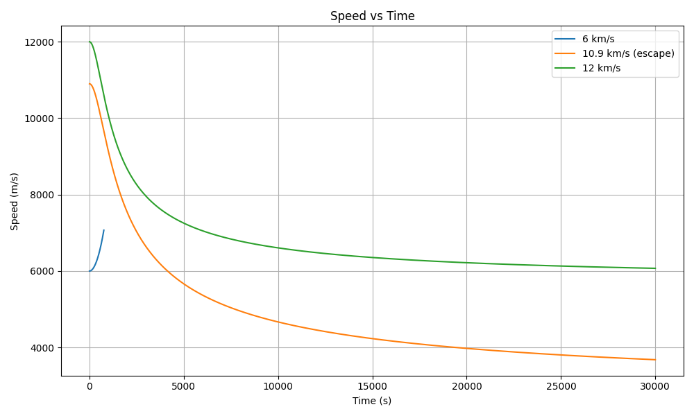
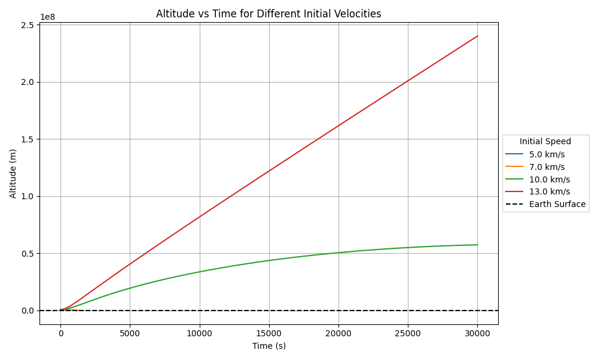

# Problem 3

# Trajectories of a Freely Released Payload Near Earth

## Motivation

When an object is released from a moving rocket near Earth, its trajectory depends on initial conditions and gravitational forces.
This scenario presents a rich problem, blending principles of orbital mechanics and numerical methods.
Understanding the potential trajectories is vital for space missions, such as deploying payloads or returning objects to Earth.

## Task

* Analyze the possible trajectories (e.g., **parabolic**, **hyperbolic**, **elliptical**) of a payload released near Earth.
* Perform a **numerical analysis** to compute the path of the payload based on given initial conditions (position, velocity, and altitude).
* Discuss how these trajectories relate to **orbital insertion**, **reentry**, or **escape** scenarios.
* Develop a **computational tool** to simulate and visualize the motion of the payload under Earth's gravity, accounting for initial velocities and directions.

## Hints and Resources

* Use fundamental gravitational principles, such as **Newton's Law of Gravitation** and **Kepler's Laws**, to derive equations and analyze scenarios.
* Leverage **numerical methods** or software tools (e.g., Python) to simulate orbits and trajectories.
* Explore real-world applications, such as **space mission planning**, **satellite deployment**, and **planetary exploration**.

These tasks provide a foundation for understanding **gravity's influence on motion** and its role in **celestial mechanics** and **space exploration**.

## Simulation Code

The following Python code simulates the motion of a payload released 800 km above Earth with varying initial speeds.
The simulation tracks the position of the payload over time under the influence of Earth's gravity, and plots the resulting trajectories.

```python
import numpy as np
import matplotlib.pyplot as plt

# Constants
G = 6.67430e-11
M_earth = 5.972e24
R_earth = 6371e3
altitude = 800e3
initial_radius = R_earth + altitude

# Simulation parameters
dt = 2
t_max = 30000

# Initial position
r0 = np.array([initial_radius, 0])

# Initial velocities
velocities_kms = np.arange(5, 13.5, 1.0)
velocities = velocities_kms * 1000

def gravity_acc(r):
    return -G * M_earth * r / np.linalg.norm(r)**3

fig, ax = plt.subplots(figsize=(8, 8))
earth = plt.Circle((0, 0), R_earth, facecolor='blue', edgecolor='black', alpha=0.5, label='Earth')
ax.add_artist(earth)
ax.scatter(0, 0, color='black', s=20, label='Center of Earth')

for v0 in velocities:
    r = r0.copy()
    v = np.array([0.0, v0])
    xs, ys = [], []

    for _ in range(t_max):
        a = gravity_acc(r)
        v += a * dt
        r += v * dt
        xs.append(r[0])
        ys.append(r[1])
        if np.linalg.norm(r) <= R_earth:
            break

    ax.plot(xs, ys, label=f'{v0/1000:.1f} km/s')

ax.set_aspect('equal')
ax.set_xlim(-2e7, 2e7)
ax.set_ylim(-2e7, 2e7)
ax.set_xlabel('x (m)')
ax.set_ylabel('y (m)')
ax.set_title('Trajectories in a Gravitational Field with Filled Earth')
ax.legend(title="Initial Speed", loc='center left', bbox_to_anchor=(1, 0.5))
plt.grid(True)
plt.tight_layout()
plt.savefig("trajectory_plot_updated.png")
plt.show()
```

## Results and Visualizations

### Simulated Payload Trajectories



### Distance from Earth vs Time (for Selected Velocities)



#### Code for Distance vs Time Plot

```python
import numpy as np
import matplotlib.pyplot as plt

G = 6.67430e-11
M_earth = 5.972e24
R_earth = 6371e3
altitude = 800e3
initial_radius = R_earth + altitude

dt = 2
t_max = 30000
steps = int(t_max / dt)

selected_velocities = [6000, 10900, 12000]
labels = ["6 km/s", "10.9 km/s", "12 km/s"]

plt.figure(figsize=(10, 6))

for v0, label in zip(selected_velocities, labels):
    r = np.array([initial_radius, 0.0])
    v = np.array([0.0, v0])
    rs, times = [], []

    for step in range(steps):
        a = -G * M_earth * r / np.linalg.norm(r)**3
        v += a * dt
        r += v * dt
        rs.append(np.linalg.norm(r))
        times.append(step * dt)
        if np.linalg.norm(r) <= R_earth:
            break

    plt.plot(times, rs, label=label)

plt.xlabel("Time (s)")
plt.ylabel("Distance from Earth's center (m)")
plt.title("Distance from Earth vs Time")
plt.axhline(R_earth, color='black', linestyle='--', label="Earth Surface")
plt.legend()
plt.grid(True)
plt.tight_layout()
plt.savefig("distance_vs_time.png")
plt.show()
```

### Speed vs Time (for Selected Velocities)



#### Code for Speed vs Time Plot

```python
import numpy as np
import matplotlib.pyplot as plt

G = 6.67430e-11
M_earth = 5.972e24
R_earth = 6371e3
altitude = 800e3
initial_radius = R_earth + altitude

dt = 2
t_max = 30000
steps = int(t_max / dt)

selected_velocities = [6000, 10900, 12000]
labels = ["6 km/s", "10.9 km/s", "12 km/s"]

plt.figure(figsize=(10, 6))

for v0, label in zip(selected_velocities, labels):
    r = np.array([initial_radius, 0.0])
    v = np.array([0.0, v0])
    speeds, times = [], []

    for step in range(steps):
        a = -G * M_earth * r / np.linalg.norm(r)**3
        v += a * dt
        r += v * dt
        speeds.append(np.linalg.norm(v))
        times.append(step * dt)
        if np.linalg.norm(r) <= R_earth:
            break

    plt.plot(times, speeds, label=label)

plt.xlabel("Time (s)")
plt.ylabel("Speed (m/s)")
plt.title("Speed vs Time")
plt.legend()
plt.grid(True)
plt.tight_layout()
plt.savefig("speed_vs_time.png")
plt.show()
```

### Altitude vs Time (for Selected Velocities)



#### Code for Altitude vs Time Plot

```python
import numpy as np
import matplotlib.pyplot as plt

G = 6.67430e-11
M = 5.972e24
R = 6371e3
altitude = 800e3
r0_mag = R + altitude

dt = 2
t_max = 30000
steps = int(t_max / dt)

velocities = [5000, 7000, 10000, 13000]
labels = ["5.0 km/s", "7.0 km/s", "10.0 km/s", "13.0 km/s"]

plt.figure(figsize=(10, 6))

for v0, label in zip(velocities, labels):
    r = np.array([r0_mag, 0.0])
    v = np.array([0.0, v0])
    altitudes, times = [], []

    for step in range(steps):
        a = -G * M * r / np.linalg.norm(r)**3
        v += a * dt
        r += v * dt
        h = np.linalg.norm(r) - R
        altitudes.append(h)
        times.append(step * dt)
        if np.linalg.norm(r) <= R:
            break

    plt.plot(times, altitudes, label=label)

plt.xlabel("Time (s)")
plt.ylabel("Altitude (m)")
plt.title("Altitude vs Time for Different Initial Velocities")
plt.axhline(0, color='black', linestyle='--', label="Earth Surface")
plt.legend(title="Initial Speed", loc="center left", bbox_to_anchor=(1, 0.5))
plt.grid(True)
plt.tight_layout()
plt.savefig("altitude_vs_time.png")
plt.show()
```

### Escape Velocity at 800 km Altitude

The theoretical escape velocity at 800 km above Earth's surface is:

$$
v_{escape} = \sqrt{ \frac{2GM}{R + h} } \approx 10.9 \, \text{km/s}
$$

This is the minimum speed required for an object to escape Earth's gravitational pull without further propulsion.
As seen in the plot, trajectories with speeds above this threshold result in escape paths.

### Observed Trajectories Summary

| Initial Velocity (km/s) | Expected Path Type   |
| ----------------------- | -------------------- |
| 5.0 – 10.5              | Elliptical / returns |
| ≈ 10.9                  | Parabolic (escape)   |
| > 11.0                  | Hyperbolic (escape)  |

## Deliverables

* A **Markdown document** with **Python script** or **notebook** implementing the simulations.
* A **detailed explanation** of the subjects.
* **Graphical representations** of orbital trajectories, escape velocities, and payload trajectories near Earth.

[visit my colab](https://colab.research.google.com/drive/1_KzOJjxbolI-tEkICkBv7iUJRX6DVmHn?usp=sharing)