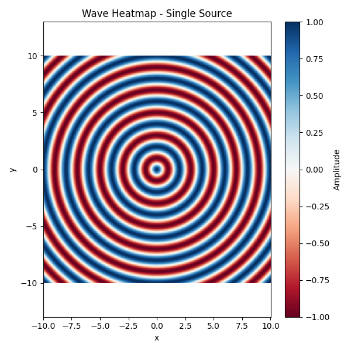
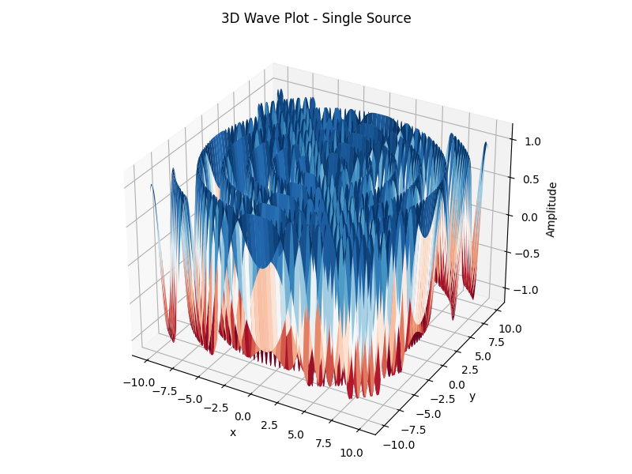
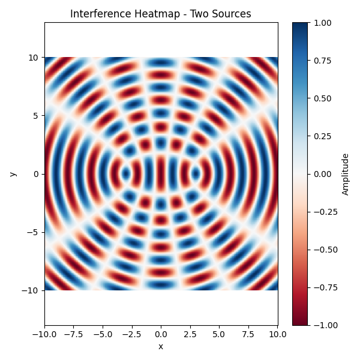
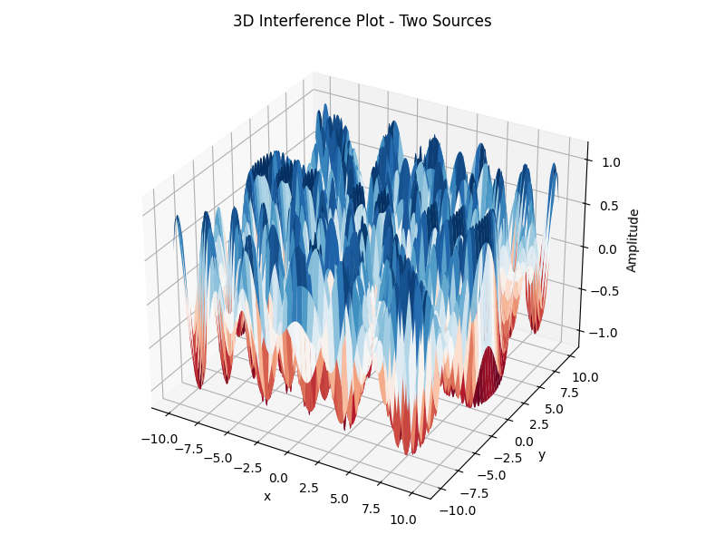
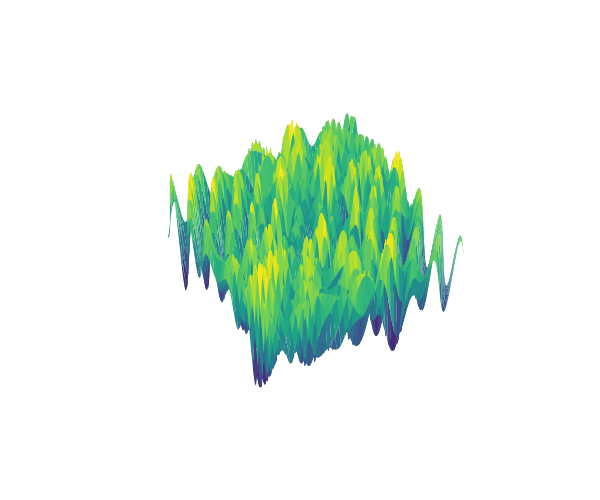

# Problem 1

# Interference Patterns on a Water Surface

## Motivation

Interference occurs when waves from different sources overlap, creating new patterns. On a water surface, this can be easily observed when ripples from different points meet, forming distinctive interference patterns. These patterns can show us how waves combine in different ways, either reinforcing each other or canceling out.

Studying these patterns helps us understand wave behavior in a simple, visual way. It also allows us to explore important concepts, like the relationship between wave phase and the effects of multiple sources. This task offers a hands-on approach to learning about wave interactions and their real-world applications, making it an interesting and engaging way to dive into wave physics.

---

## Task

A circular wave on the water surface, emanating from a point source located at $(x_0, y_0)$, can be described by the single disturbance equation:

$$
\eta(x, y, t) = \frac{A}{\sqrt{r}} \cdot \cos(kr - \omega t + \phi)
$$

Where:

- $\eta(x, y, t)$ — displacement of the water surface at point $(x, y)$ and time $t$
- $A$ — amplitude of the wave  
- $k = \dfrac{2\pi}{\lambda}$ — wave number (related to wavelength $\lambda$)  
- $\omega = 2\pi f$ — angular frequency (related to frequency $f$)  
- $r = \sqrt{(x - x_0)^2 + (y - y_0)^2}$ — distance from the source to point $(x, y)$  
- $\phi$ — initial phase

---

## Problem Statement

Your task is to analyze the interference patterns formed on the water surface due to the superposition of waves emitted from point sources placed at the vertices of a chosen regular polygon.

---

## Steps to Follow

1. **Select a Regular Polygon**: Choose a regular polygon (e.g., equilateral triangle, square, regular pentagon).

2. **Position the Sources**: Place point wave sources at the vertices of the selected polygon.

3. **Wave Equations**: Write the equations describing the waves emitted from each source, considering their respective positions.

4. **Superposition of Waves**: Apply the principle of superposition by summing the wave displacements at each point on the water surface:

$$
\eta_{\text{sum}}(x, y, t) = \sum_{i=1}^{N} \eta_i(x, y, t)
$$

Where:

- $N$ — the number of sources (i.e., the number of vertices of the polygon)

---

The following code simulates the wave propagation from a single point source on a 2D water surface. Both a heatmap and 3D surface plot are used to visualize the wave pattern.

```python
import numpy as np
import matplotlib.pyplot as plt
from mpl_toolkits.mplot3d import Axes3D

# Create the spatial grid
x = np.linspace(-10, 10, 500)
y = np.linspace(-10, 10, 500)
X, Y = np.meshgrid(x, y)

# Wave parameters
A = 1                    # Amplitude
wavelength = 2
k = 2 * np.pi / wavelength   # Wave number
omega = 2 * np.pi            # Angular frequency
phi = 0                      # Initial phase
t = 0                        # Time snapshot

# Position of the single point source
x0, y0 = (0, 0)

# Distance from each grid point to the source
r = np.sqrt((X - x0)**2 + (Y - y0)**2)

# Wave function without amplitude attenuation
eta = np.cos(k * r - omega * t + phi)

# --- HEATMAP ---
plt.figure(figsize=(6, 6))
plt.pcolormesh(X, Y, eta, shading='auto', cmap='RdBu')
plt.colorbar(label='Amplitude')
plt.clim(-1, 1)
plt.axis('equal')
plt.title("Wave Heatmap - Single Source")
plt.xlabel("x")
plt.ylabel("y")
plt.tight_layout()
plt.savefig("heatmap_single.png")
plt.show()

# --- 3D PLOT ---
fig = plt.figure(figsize=(8, 6))
ax = fig.add_subplot(111, projection='3d')
ax.plot_surface(X, Y, eta, cmap='RdBu', linewidth=0, antialiased=True)
ax.set_title("3D Wave Plot - Single Source")
ax.set_xlabel("x")
ax.set_ylabel("y")
ax.set_zlabel("Amplitude")
ax.set_zlim(-1.2, 1.2)
plt.tight_layout()
plt.savefig("wave3d_single.png")
plt.show()
```
## Simulation: Heatmap from a Single Point Source



> This heatmap shows the amplitude distribution of the wave from a single point source over a 2D grid.

## Simulation: 3D Wave Surface from a Single Point Source



## Simulation: Heatmap from Two Point Sources

The following Python code simulates the wave interference caused by two identical point sources. The resulting interference pattern is visualized as both a heatmap and a 3D surface plot.

```python
import numpy as np
import matplotlib.pyplot as plt
from mpl_toolkits.mplot3d import Axes3D

# Grid
x = np.linspace(-10, 10, 500)
y = np.linspace(-10, 10, 500)
X, Y = np.meshgrid(x, y)

# Parameters
wavelength = 2
k = 2 * np.pi / wavelength
omega = 2 * np.pi
phi = 0
t = 0

# Two sources
source1 = (-3, 0)
source2 = (3, 0)

# Distance from each source
r1 = np.sqrt((X - source1[0])**2 + (Y - source1[1])**2)
r2 = np.sqrt((X - source2[0])**2 + (Y - source2[1])**2)

# Interference pattern (no amplitude attenuation)
eta = np.cos(k * r1 - omega * t + phi) + np.cos(k * r2 - omega * t + phi)
eta /= 2

# --- HEATMAP ---
plt.figure(figsize=(6, 6))
plt.pcolormesh(X, Y, eta, shading='auto', cmap='RdBu')
plt.colorbar(label='Amplitude')
plt.clim(-1, 1)
plt.axis('equal')
plt.title("Interference Heatmap - Two Sources")
plt.xlabel("x")
plt.ylabel("y")
plt.tight_layout()
plt.savefig("interference_two_sources.png")
plt.show()

# --- 3D PLOT ---
fig = plt.figure(figsize=(8, 6))
ax = fig.add_subplot(111, projection='3d')
ax.plot_surface(X, Y, eta, cmap='RdBu', linewidth=0, antialiased=True)
ax.set_title("3D Interference Plot - Two Sources")
ax.set_xlabel("x")
ax.set_ylabel("y")
ax.set_zlabel("Amplitude")
ax.set_zlim(-1.2, 1.2)
plt.tight_layout()
plt.savefig("interference3d_two_sources.png")
plt.show()
```
## Interference Pattern - Two Sources



> This figure shows a clear interference pattern generated by two sources placed symmetrically along the x-axis.

## Simulation: 3D Interference Surface from Two Point Sources



> A 3D surface plot of the interference wave pattern created by two point sources placed symmetrically on the x-axis.


# 🌊 Wave Interference Visualization

This project simulates and visualizes 2D wave interference using multiple point sources.

## 🎯 Objective

Visualize wave interference for:
- 1 source
- 2 sources
- 3 sources in triangle layout
- 5 sources in pentagon layout

Both 2D heatmaps and a 3D animation are included.

---

## 📈 GIF Animations

### 🔵 One Source (GIF)


### 🔵 Two Sources (GIF)


### 🔺 Triangle Sources (GIF)


### ⬟ Pentagon (3D View) (GIF)


---

## Considerations

- Assume all sources emit waves with the same amplitude $A$, wavelength $\lambda$, and frequency $f$.
- The waves are coherent, maintaining a constant phase difference.
- You may use simulation and visualization tools such as Python (with libraries like Matplotlib), or other graphical software to aid in your analysis.

---

## Deliverables

1. A Markdown document with Python script or notebook implementing the simulations.

2. A detailed explanation of the interference patterns observed for the chosen regular polygon with the goal of understanding wave superposition.

3. Graphical representations of the water surface showing constructive and destructive interference regions.

## 🧩 Conclusion

The simulations clearly demonstrate how wave interference patterns depend on the number and arrangement of sources.  
Two sources produce the classic constructive and destructive bands, while triangle and pentagon layouts create more complex and symmetric patterns.  
This highlights how the principle of superposition leads to rich and predictable wave behaviors in 2D media.

[visit my colab](https://colab.research.google.com/drive/1UWsXvwAD7Ij8YiMYlzIEpue_a8ts-pTV?usp=sharing)