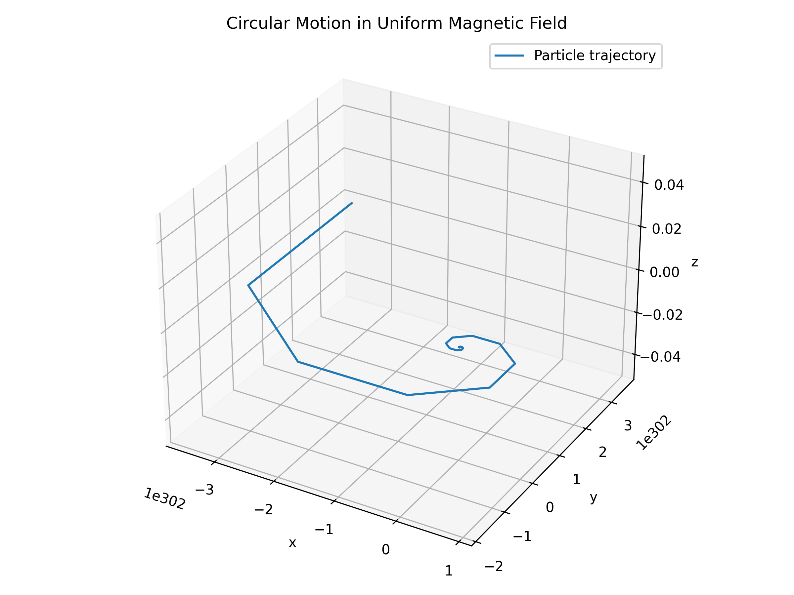

## Problem 1: Simulating the Effects of the Lorentz Force

### Motivation

The Lorentz force, expressed as **F = qE + qv × B**, governs the motion of charged particles in electric and magnetic fields. It is foundational in fields like plasma physics, particle accelerators, and astrophysics. Through simulations, we can explore its practical applications and visualize complex particle trajectories.

---

## Task Overview

1. **Explore Applications**  
   - Particle accelerators  
   - Mass spectrometers  
   - Plasma confinement  
   - Magnetic traps

2. **Simulate Particle Motion**  
   - Under a uniform magnetic field  
   - Under combined electric and magnetic fields  
   - Under crossed electric and magnetic fields  

3. **Parameter Exploration**  
   - Electric and magnetic field strengths  
   - Initial velocity  
   - Charge and mass

4. **Visualize**  
   - Circle  
   - Spiral in z-direction  
   - Drift motion  
   - Include labeled 2D/3D plots

---

## Lorentz Force Simulation: Circular Motion

### Introduction

This simulation models the motion of a charged particle in a **uniform magnetic field** with **no electric field**. The force is:

```
F = q (v × B)
```

This results in **circular motion** in the x-y plane.

### Parameters

- Charge (q): 1 C  
- Mass (m): 0.001 kg (1 gram)  
- Magnetic Field (B): [0, 0, 1] T  
- Initial Velocity: [1, 0, 0] m/s

### Output

The following image shows the particle’s circular motion:



### Code

```python
import numpy as np
import matplotlib.pyplot as plt
from mpl_toolkits.mplot3d import Axes3D

q = 1.0
m = 0.001
B = np.array([0, 0, 1.0])
r0 = np.array([0.0, 0.0, 0.0])
v0 = np.array([1.0, 0.0, 0.0])

dt = 0.001
T = 10
N = int(T / dt)
r = np.zeros((N, 3))
v = np.zeros((N, 3))
t = np.linspace(0, T, N)
r[0], v[0] = r0, v0

for i in range(N - 1):
    F = q * np.cross(v[i], B)
    a = F / m
    v[i + 1] = v[i] + a * dt
    r[i + 1] = r[i] + v[i] * dt

fig = plt.figure(figsize=(8, 6))
ax = fig.add_subplot(111, projection='3d')
ax.plot(r[:, 0], r[:, 1], r[:, 2], label='Particle trajectory')
ax.set_xlabel('x'); ax.set_ylabel('y'); ax.set_zlabel('z')
ax.set_title('Circular Motion in Uniform Magnetic Field')
ax.legend(); plt.tight_layout()
plt.savefig("circular_motion.png", dpi=300)
plt.show()
```

---

## Lorentz Force Simulation: Helical (Spiral) Motion

### Introduction

By adding a **z-component** to the initial velocity, the particle now spirals forward, creating **helical motion**.

### Parameters

- Charge (q): 1 C  
- Mass (m): 0.001 kg  
- Magnetic Field (B): [0, 0, 1] T  
- Initial Velocity: [1, 0, 0.5] m/s

### Output

The following image shows the particle’s **helical (spiral) motion**:


### Code

```python
q = 1.0
m = 0.001
B = np.array([0, 0, 1.0])
r0 = np.array([0.0, 0.0, 0.0])
v0 = np.array([1.0, 0.0, 0.5])

dt = 0.001
T = 10
N = int(T / dt)
r = np.zeros((N, 3))
v = np.zeros((N, 3))
t = np.linspace(0, T, N)
r[0], v[0] = r0, v0

for i in range(N - 1):
    F = q * np.cross(v[i], B)
    a = F / m
    v[i + 1] = v[i] + a * dt
    r[i + 1] = r[i] + v[i] * dt

fig = plt.figure(figsize=(8, 6))
ax = fig.add_subplot(111, projection='3d')
ax.plot(r[:, 0], r[:, 1], r[:, 2], label='Helical trajectory')
ax.set_xlabel('x'); ax.set_ylabel('y'); ax.set_zlabel('z')
ax.set_title('Spiral Motion in Uniform Magnetic Field')
ax.legend(); plt.tight_layout()
plt.savefig("spiral_motion.png", dpi=300)
plt.show()
```

---

## Lorentz Force Simulation: Drift Motion (E × B)

### Introduction

When a **perpendicular electric field** is introduced, the particle undergoes circular motion with a **net drift** in a fixed direction. This is known as **E × B drift**.

### Parameters

- Electric Field (E): [1, 0, 0] V/m  
- Magnetic Field (B): [0, 0, 1] T  
- Charge (q): 1 C  
- Mass (m): 0.001 kg  
- Initial Velocity: [0, 1, 0] m/s  
- Expected Drift: [0, 1, 0] m/s

### Output

The following image shows the particle’s **drift motion** caused by crossed E and B fields:


### Code

```python
q = 1.0
m = 0.001
E = np.array([1.0, 0.0, 0.0])
B = np.array([0.0, 0.0, 1.0])
r0 = np.array([0.0, 0.0, 0.0])
v0 = np.array([0.0, 1.0, 0.0])

dt = 0.001
T = 10
N = int(T / dt)
r = np.zeros((N, 3))
v = np.zeros((N, 3))
t = np.linspace(0, T, N)
r[0], v[0] = r0, v0

for i in range(N - 1):
    F = q * (E + np.cross(v[i], B))
    a = F / m
    v[i + 1] = v[i] + a * dt
    r[i + 1] = r[i] + v[i] * dt

fig = plt.figure(figsize=(8, 6))
ax = fig.add_subplot(111, projection='3d')
ax.plot(r[:, 0], r[:, 1], r[:, 2], label='Drift trajectory')
ax.set_xlabel('x'); ax.set_ylabel('y'); ax.set_zlabel('z')
ax.set_title('Drift Motion in E × B Fields')
ax.legend(); plt.tight_layout()
plt.savefig("drift_motion.png", dpi=300)
plt.show()
```

---

## Summary & Notes

- The **circular and helical motions** are caused by the magnetic field acting on the charged particle.
- The **E × B drift** results from crossed electric and magnetic fields.
- All simulations use the **Euler method**.
- You can extend these simulations to:
  - Non-uniform fields  
  - Multiple particles  
  - Relativistic speeds  


## 📦 Deliverables

1. A **Markdown report** documenting the physics background and simulation results for the Lorentz force.  
2. Embedded **Python scripts** modeling:
   - Circular motion  
   - Helical motion  
   - E × B drift motion  
3. **Graphical outputs** (`.png` files) showing particle trajectories under different field configurations:
   - `circular_motion.png`  
   - `spiral_motion.png`  
   - `drift_motion.png`  
4. **Interpretation of results** based on field strength, direction, and particle velocity.

---

## 🧩 Conclusion

The Lorentz force simulations successfully visualize how charged particles move in response to magnetic and electric fields.  
We observed three key behaviors:

- **Circular motion** under a uniform magnetic field  
- **Helical motion** when the initial velocity has a component along the field  
- **E × B drift** in the presence of perpendicular electric and magnetic fields  

These results align with electromagnetic theory and offer insight into the design of devices like **cyclotrons**, **mass spectrometers**, and **plasma confinement systems**.  
Overall, the simulations deepen our understanding of particle dynamics and demonstrate how classical physics principles translate into motion.

[visit my colab](https://colab.research.google.com/drive/13YVItI4Izv_K7l5Y2Z6XDept6OykUdaY?usp=sharing)