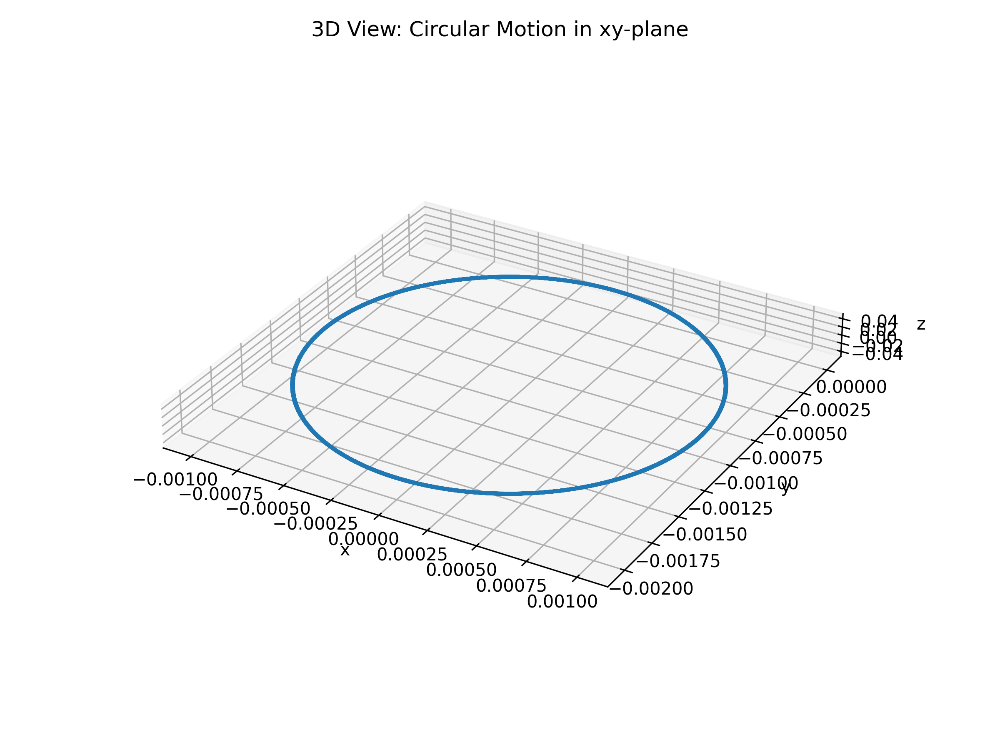
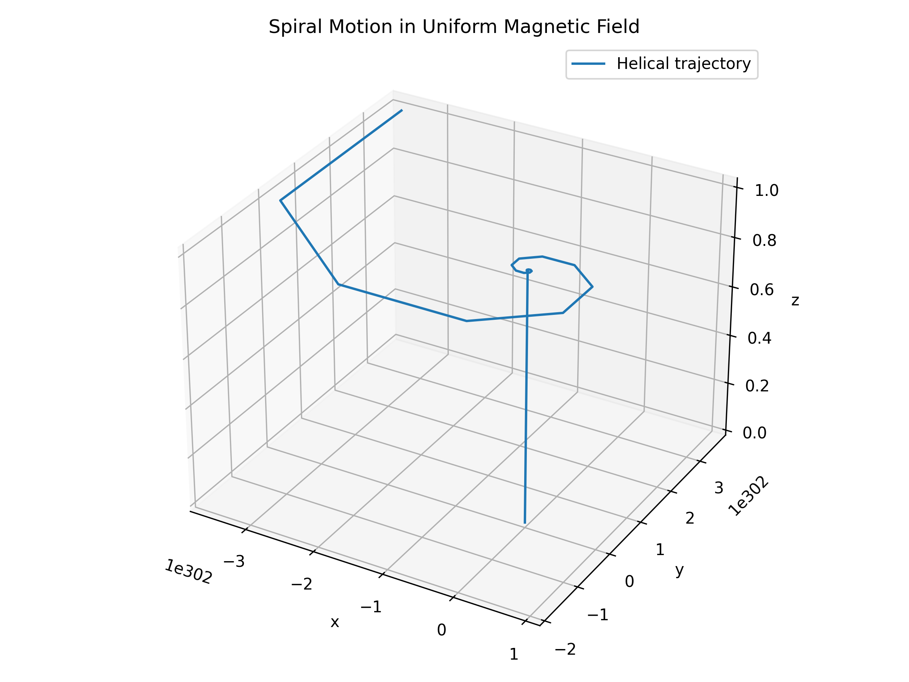
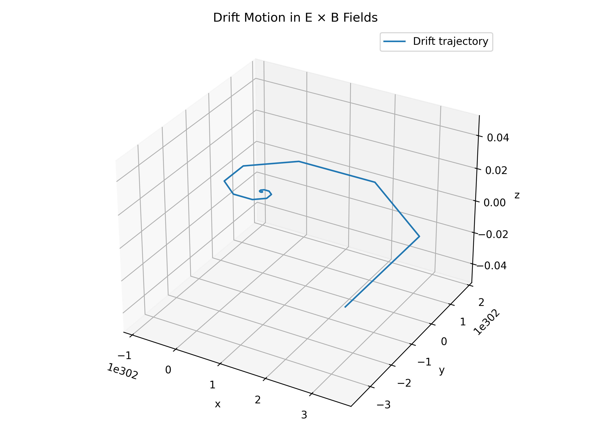
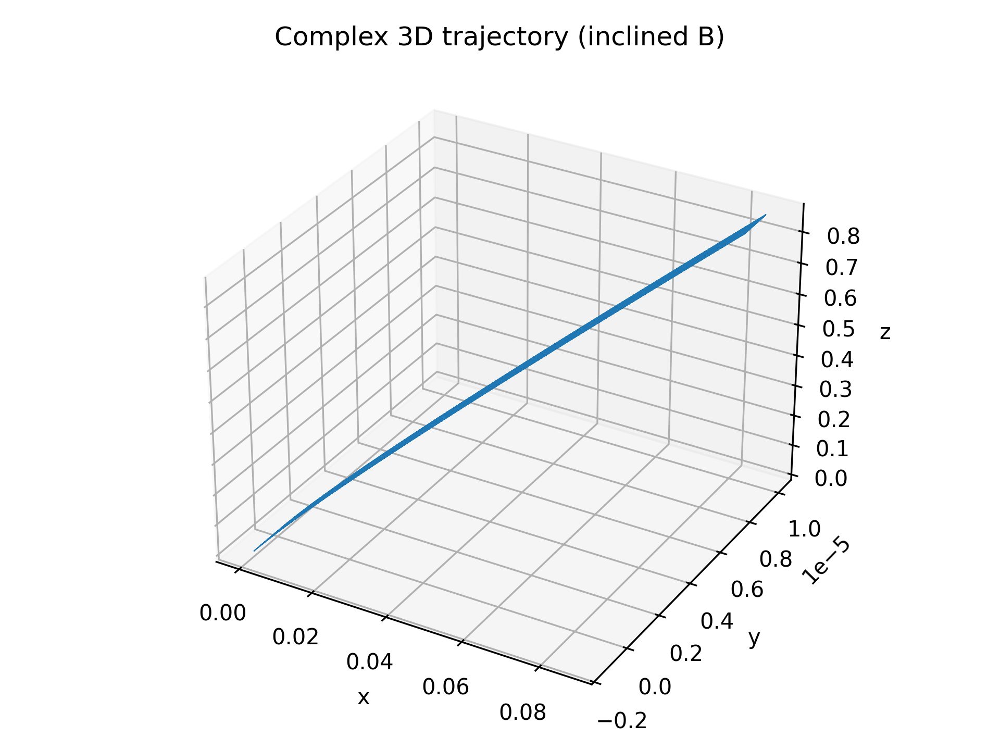

# Problem 1: Simulating the Effects of the Lorentz Force

## Motivation

The Lorentz force, expressed as **F = qE + q(v × B)**, governs the motion of charged particles in electric and magnetic fields. It plays a central role in plasma physics, mass spectrometry, particle accelerators, and astrophysics. Through simulation, we can visualize particle dynamics and build intuition about how they behave in various field configurations.

---

## Task Overview

1. **Explore Applications**

   * Particle accelerators
   * Mass spectrometers
   * Plasma confinement
   * Magnetic traps

2. **Simulate Particle Motion**

   * Under a uniform magnetic field
   * Under combined electric and magnetic fields
   * Under crossed electric and magnetic fields

3. **Parameter Exploration**

   * Electric and magnetic field strengths
   * Initial velocity
   * Charge and mass (q = 1 C, m = 1 g = 0.001 kg)

4. **Visualize**

   * Circular trajectory
   * Spiral in z-direction
   * Complex or drift motion
   * Include labeled 2D/3D plots

---

## Lorentz Force Simulation: Circular Motion

### Introduction

In a **uniform magnetic field** with **no electric field**, the Lorentz force reduces to:

**F = q (v × B)**

This results in **circular motion** in the x-y plane as the force is always perpendicular to the velocity.

### Parameters

* Charge (q): 1 C
* Mass (m): 0.001 kg
* Magnetic Field (B): \[0, 0, 1] T
* Initial Velocity: \[1, 0, 0] m/s

### Output

*Figure: Particle follows a circular path in the x-y plane.*

---

## Lorentz Force Simulation: Helical (Spiral) Motion

### Introduction

Adding a **z-component** to the initial velocity causes the particle to move forward while rotating, forming a **helical (spiral) trajectory**.

### Parameters

* Charge (q): 1 C
* Mass (m): 0.001 kg
* Magnetic Field (B): \[0, 0, 1] T
* Initial Velocity: \[1, 0, 0.5] m/s

### Output

*Figure: Helical motion caused by a velocity component along the magnetic field.*

---

## Lorentz Force Simulation: Drift Motion (E × B)

### Introduction

With a **perpendicular electric field**, the particle undergoes circular motion but also drifts in a straight direction, forming an **E × B drift**.

### Parameters

* Electric Field (E): \[1, 0, 0] V/m
* Magnetic Field (B): \[0, 0, 1] T
* Charge (q): 1 C
* Mass (m): 0.001 kg
* Initial Velocity: \[0, 1, 0] m/s

### Output

*Figure: Drift motion in crossed electric and magnetic fields.*

---

## Complex 3D Trajectory (Inclined Fields with Boris Algorithm)

### Description

This simulation uses the **Boris algorithm** to compute the motion of a charged particle under:

* A uniform electric field in the z-direction
* An inclined magnetic field with components in both x and z

This results in a **complex drift trajectory** due to the E × B interaction.

### Parameters

* Charge (q): 1 C
* Mass (m): 0.001 kg
* Electric Field (E): \[0, 0, 1000] V/m
* Magnetic Field (B): \[0.1, 0, 1] T
* Initial Velocity: \[1e5, 0, 0] m/s

### Output

*Figure: 3D trajectory with electric and inclined magnetic fields.*

---

## Summary & Notes

* **Circular motion** results from a velocity perpendicular to the magnetic field.
* **Helical motion** arises when the velocity also has a component along the magnetic field.
* **E × B drift** appears when the electric and magnetic fields are perpendicular.
* The **Boris algorithm** provides stable motion simulation under combined fields.
* All simulations use classical (non-relativistic) physics.

---

## 📦 Deliverables

1. **Markdown report** with simulations of Lorentz force scenarios
2. Embedded Python code and explanations for:

   * Circular motion
   * Helical motion
   * E × B drift
   * Complex inclined field trajectory
3. **Plots**:

   * circular\_motion\_3D.png
   * spiral\_motion.png
   * drift\_motion.png
   * complex\_trajectory.png

---

## 🧩 Conclusion

The Lorentz force simulations demonstrate key aspects of particle motion in electromagnetic fields. Through different initial conditions and field setups, we observed:

* Circular trajectories in pure magnetic fields
* Helical motion from axial velocity components
* Net drift due to crossed electric and magnetic fields
* Complex 3D paths with inclined fields

These results mirror behaviors in real-world systems like **mass spectrometers**, **plasma traps**, and **magnetic confinement devices**, validating the predictive power of classical electromagnetism.

---

[visit my colab](https://colab.research.google.com/drive/13YVItI4Izv_K7l5Y2Z6XDept6OykUdaY?usp=sharing)
