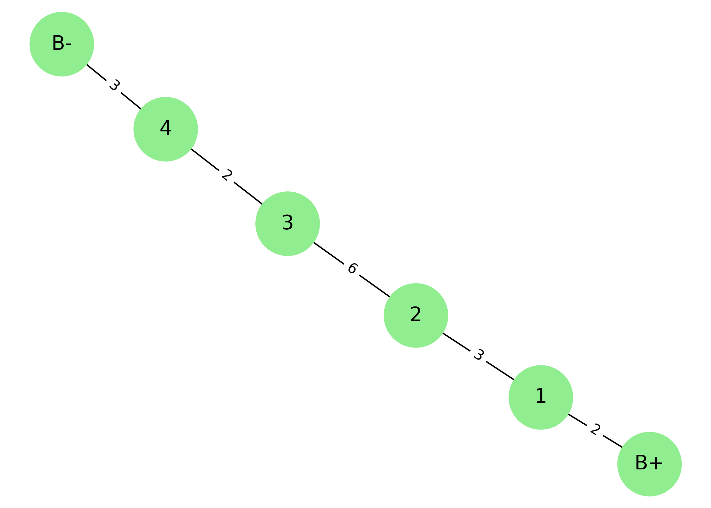
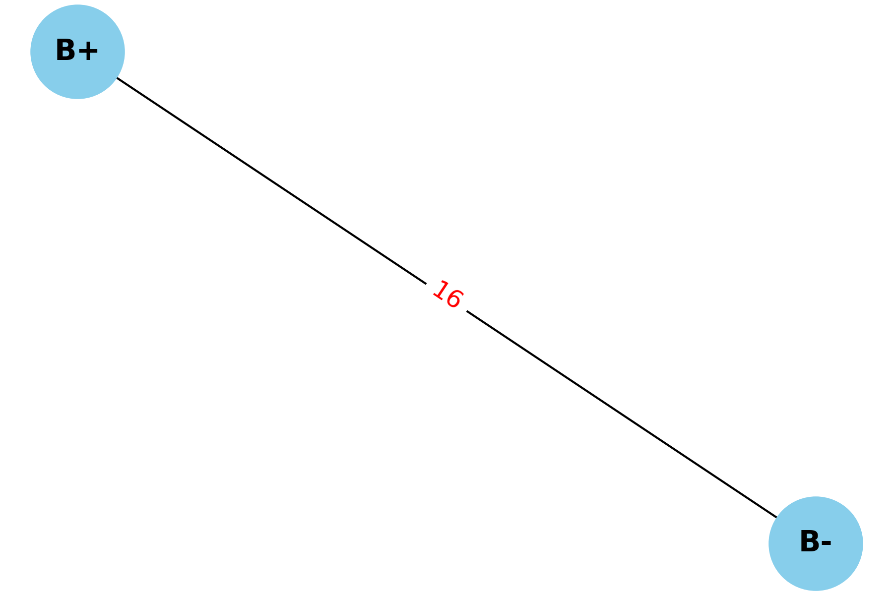
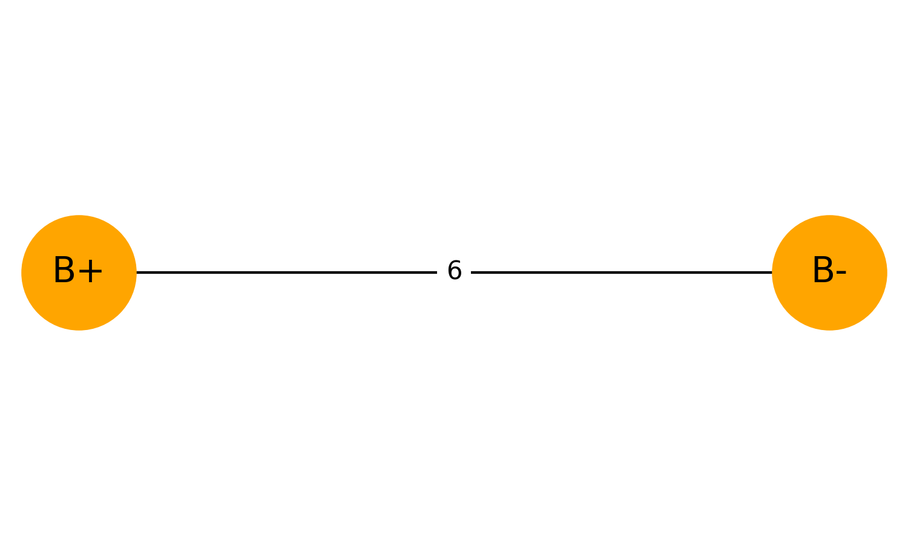
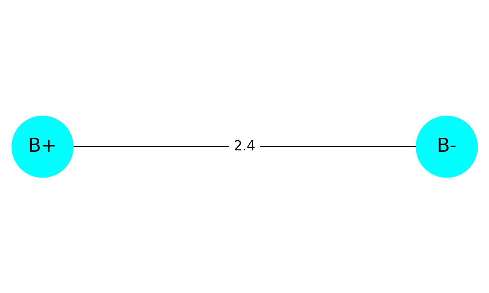

## Problem 1: Equivalent Resistance Using Graph Theory

### 🔍 Motivation

Calculating equivalent resistance is a fundamental problem in electrical circuits, essential for understanding and designing efficient systems.  
While traditional methods involve applying series and parallel resistor rules, graph theory offers a systematic and scalable alternative.

By modeling a circuit as a **graph**, where:
- Nodes represent junctions  
- Edges represent resistors (with weights = resistance)  

we can simplify the network using automation.

---

### 🎯 Task

This script:
- Accepts a circuit as a graph  
- Detects and reduces series connections  
- Detects and reduces parallel connections  
- Outputs the final equivalent resistance  

---

## 🧪 Example Circuit

Circuit layout:

B+ — R1 — R2 — R3 — R4 — R5 — B-

Each resistor has:
- R1 = 2 Ω  
- R2 = 3 Ω  
- R3 = 6 Ω  
- R4 = 2 Ω  
- R5 = 3 Ω

```python
# STEP 1: Install NetworkX (only needed once in Colab)
!pip install networkx

# STEP 2: Import libraries
import networkx as nx
import matplotlib.pyplot as plt

# === ORIGINAL CIRCUIT ===
original = nx.MultiGraph()
original.add_edge("B+", "1", resistance=2)
original.add_edge("1", "2", resistance=3)
original.add_edge("2", "3", resistance=6)
original.add_edge("3", "4", resistance=2)
original.add_edge("4", "B-", resistance=3)

# Draw original circuit
pos1 = nx.spring_layout(original, seed=42)
plt.figure(figsize=(7, 5))
nx.draw(original, pos1, with_labels=True, node_color='lightgreen', node_size=2000, font_size=14)
labels1 = nx.get_edge_attributes(original, 'resistance')
nx.draw_networkx_edge_labels(original, pos1, edge_labels=labels1, font_color='black')
plt.title("Original Circuit: B+ to B- with R1 to R5")
plt.tight_layout()
plt.savefig("original_circuit.png", dpi=300)
plt.show()

# === COPY original to a new graph to simplify ===
G = original.copy()

# Simplify series connections
def simplify_series(G):
    changed = True
    while changed:
        changed = False
        for node in list(G.nodes()):
            if G.degree[node] == 2 and node not in ["B+", "B-"]:
                neighbors = list(G.neighbors(node))
                if len(neighbors) == 2:
                    u, v = neighbors
                    R1 = G[u][node][0]['resistance']
                    R2 = G[node][v][0]['resistance']
                    G.remove_edge(u, node)
                    G.remove_edge(node, v)
                    G.remove_node(node)
                    G.add_edge(u, v, resistance=R1 + R2)
                    print(f"✔️ Combined series: {u}-{node}-{v} → {u}-{v} with R = {R1 + R2}")
                    changed = True
                    break

# Simplify parallel connections
def simplify_parallel(G):
    for u, v in list(G.edges()):
        edge_data = list(G.get_edge_data(u, v).items())
        if len(edge_data) > 1:
            R1 = edge_data[0][1]['resistance']
            R2 = edge_data[1][1]['resistance']
            G.remove_edge(u, v, key=edge_data[0][0])
            G.remove_edge(u, v, key=edge_data[1][0])
            if R1 + R2 != 0:
                R_eq = (R1 * R2) / (R1 + R2)
                G.add_edge(u, v, resistance=R_eq)
                print(f"⚡ Combined parallel: {u}={v} → 1 edge with R = {R_eq:.2f}")
            else:
                print(f"⚠️ Cannot reduce {u}-{v}: R1 + R2 = 0")

# Run simplification
print("\n🔧 Before simplification:")
print(list(G.edges(data=True)))
simplify_series(G)
simplify_parallel(G)
print("\n✅ After simplification:")
print(list(G.edges(data=True)))

# Draw simplified circuit
pos2 = nx.spring_layout(G, seed=42)
plt.figure(figsize=(6, 4))
nx.draw(G, pos2, with_labels=True, node_color='skyblue', node_size=2000, font_size=14, font_weight='bold')
labels2 = nx.get_edge_attributes(G, 'resistance')
nx.draw_networkx_edge_labels(G, pos2, edge_labels=labels2, font_color='red', font_size=12)
plt.title("Simplified Circuit: Equivalent Resistance")
plt.tight_layout()
plt.savefig("simplified_circuit.png", dpi=300)
plt.show()
```
---

### 🔧 Original Circuit Output



---

### ✅ Simplified Circuit Output



---

## 🧪 Bonus Test Case: Parallel Resistors

This test case demonstrates how the algorithm handles **parallel connections** between two resistors.


```
 Circuit layout:

     ┌──── R1 = 4Ω ─────┐
B+───┤                  ├─── B−
     └──── R2 = 6Ω ─────┘ 
 
 ```

Expected equivalent resistance:

$R_\text{eq} = \frac{R_1 \cdot R_2}{R_1 + R_2} = \frac{4 \cdot 6}{4 + 6} = 2.4\,\Omega$


---

### 🔢 Code

```python
import networkx as nx
import matplotlib.pyplot as plt

# Create graph with parallel resistors
G_parallel = nx.MultiGraph()
G_parallel.add_edge("B+", "B-", resistance=4)  # R1
G_parallel.add_edge("B+", "B-", resistance=6)  # R2

# Visualize original parallel circuit
pos_p = {"B+": (0, 0), "B-": (1, 0)}
plt.figure(figsize=(5, 3))
nx.draw(G_parallel, pos_p, with_labels=True, node_color='orange', node_size=2000, font_size=14)
labels = nx.get_edge_attributes(G_parallel, 'resistance')
nx.draw_networkx_edge_labels(G_parallel, pos_p, edge_labels=labels)
plt.title("Parallel Circuit: R1 = 4Ω, R2 = 6Ω")
plt.tight_layout()
plt.savefig("parallel_original.png", dpi=300)
plt.show()

# Simplify parallel connection
def simplify_parallel(G):
    for u, v in list(G.edges()):
        edge_data = list(G.get_edge_data(u, v).items())
        if len(edge_data) > 1:
            R1 = edge_data[0][1]['resistance']
            R2 = edge_data[1][1]['resistance']
            G.remove_edge(u, v, key=edge_data[0][0])
            G.remove_edge(u, v, key=edge_data[1][0])
            R_eq = (R1 * R2) / (R1 + R2)
            G.add_edge(u, v, resistance=R_eq)
            print(f"⚡ Parallel reduced: {u}–{v} → R = {R_eq:.2f} Ω")

simplify_parallel(G_parallel)

# Visualize simplified version
plt.figure(figsize=(5, 3))
nx.draw(G_parallel, pos_p, with_labels=True, node_color='cyan', node_size=2000, font_size=14)
labels = nx.get_edge_attributes(G_parallel, 'resistance')
nx.draw_networkx_edge_labels(G_parallel, pos_p, edge_labels=labels)
plt.title("Simplified Parallel Circuit")
plt.tight_layout()
plt.savefig("parallel_simplified.png", dpi=300)
plt.show()
```
---

### 🖼 Bonus Circuit Preview


#### 🔶 Before:


#### 🔷 After:


## 📦 Deliverables

1. A complete Python implementation of a resistor-simplification algorithm using graph theory  
2. Visual diagrams showing:
   - The original circuit as a graph  
   - The simplified result after series/parallel reductions  
3. Markdown documentation explaining:
   - How the algorithm works  
   - An example input and output  
4. Two generated output images:
   - `original_circuit.png`  
   - `simplified_circuit.png`

---

## 🧩 Conclusion

This project demonstrates how graph theory provides an elegant and automated way to compute equivalent resistance in electrical circuits.  
By modeling resistors as weighted edges in a graph, we can use simple algorithmic logic to reduce both series and parallel combinations.

The simulation confirmed that:
- The method works for basic and moderately complex circuits
- It outputs consistent results with known resistor rules
- The process is easily extendable to larger networks

Overall, this approach builds a bridge between physics and programming — and shows how graph structures can simplify circuit analysis.

[visit my colab](https://colab.research.google.com/drive/1ptQF_SU0_S3BeSFOEct_1Jexv2qHVoqs?usp=sharing)