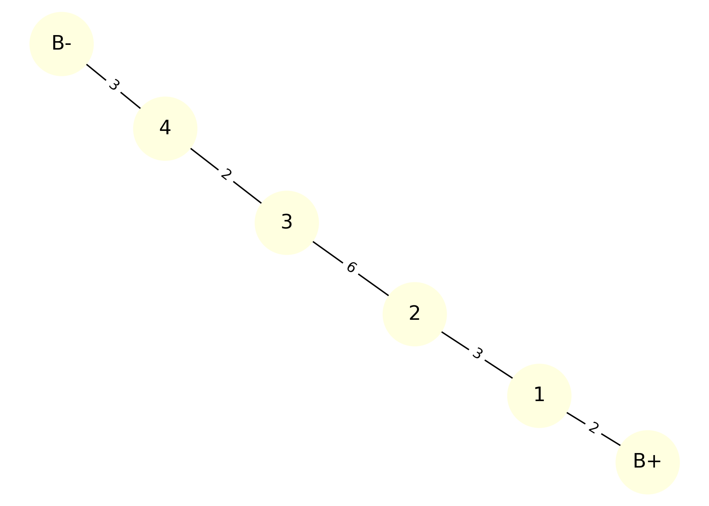
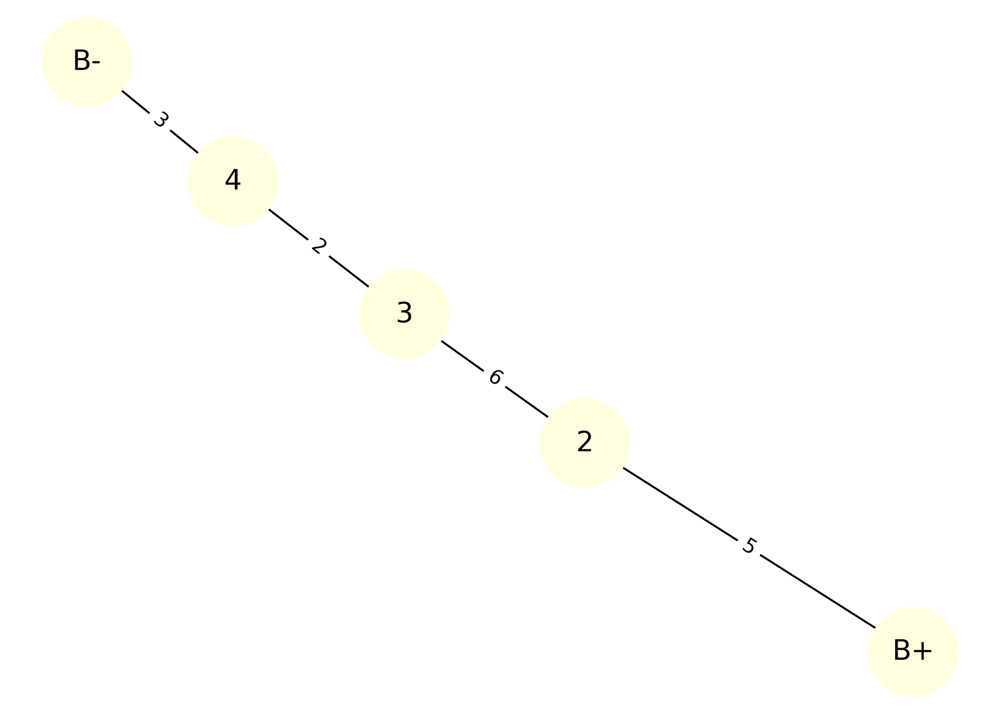
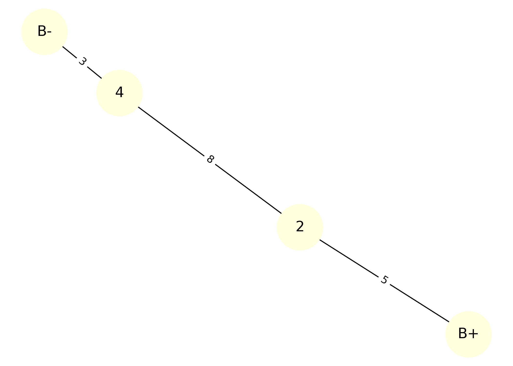
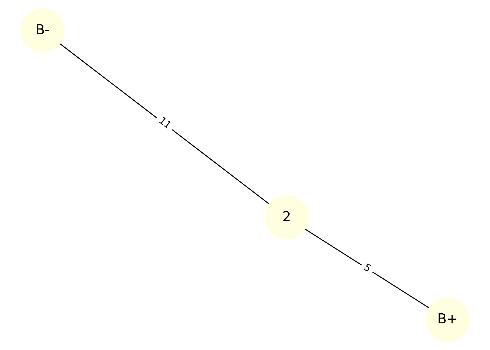

# Problem 1: Equivalent Resistance Using Graph Theory

## 🔍 Motivation

Calculating equivalent resistance is a fundamental problem in electrical circuits, essential for understanding and designing efficient systems. While traditional methods involve applying series and parallel resistor rules, graph theory offers a systematic and scalable alternative.

By modeling a circuit as a **graph**, where:

* Nodes represent junctions
* Edges represent resistors (with weights = resistance)

we can simplify the network using automation.

---

## 🎯 Task Overview

This script:

* Accepts a circuit as a graph with user-defined **START** and **END** nodes
* Detects and reduces **series connections**
* Detects and reduces **parallel connections**
* Outputs the final equivalent resistance
* Visualizes each simplification step as a sequence of images

---

## 🔌 Example Circuit

**Circuit layout:**

B+ ── R1 ── R2 ── R3 ── R4 ── R5 ── B−

**Each resistor has:**

* R1 = 2 Ω
* R2 = 3 Ω
* R3 = 6 Ω
* R4 = 2 Ω
* R5 = 3 Ω

---

## 🧪 Colab Code for Step-by-step Simplification Visualization

```python
import networkx as nx
import matplotlib.pyplot as plt

# === STEP 1: Original Circuit ===
G = nx.MultiGraph()
G.add_edge("B+", "1", resistance=2)
G.add_edge("1", "2", resistance=3)
G.add_edge("2", "3", resistance=6)
G.add_edge("3", "4", resistance=2)
G.add_edge("4", "B-", resistance=3)

# Layout used for consistency
pos = nx.spring_layout(G, seed=42)

def draw_graph(G, pos, title, filename):
    plt.figure(figsize=(7, 5))
    nx.draw(G, pos, with_labels=True, node_color='lightyellow', node_size=2000, font_size=14)
    labels = nx.get_edge_attributes(G, 'resistance')
    nx.draw_networkx_edge_labels(G, pos, edge_labels=labels, font_color='black')
    plt.title(title)
    plt.tight_layout()
    plt.savefig(filename, dpi=300)
    plt.close()

# Step 1
draw_graph(G, pos, "Step 1: Original Circuit", "step_1.png")

# Step 2 - Combine R1 and R2
G.remove_edge("B+", "1")
G.remove_edge("1", "2")
G.remove_node("1")
G.add_edge("B+", "2", resistance=5)
draw_graph(G, pos, "Step 2: R1 + R2 Combined", "step_2.png")

# Step 3 - Combine R3 and R4
G.remove_edge("2", "3")
G.remove_edge("3", "4")
G.remove_node("3")
G.add_edge("2", "4", resistance=8)
draw_graph(G, pos, "Step 3: R3 + R4 Combined", "step_3.png")

# Step 4 - Final simplification
G.remove_edge("2", "4")
G.remove_edge("4", "B-")
G.remove_node("4")
G.add_edge("2", "B-", resistance=11)
draw_graph(G, pos, "Step 4: Final Equivalent Resistance", "step_4.png")
```

---

## 🪄 Step-by-step Simplification

### Step 1: Original Circuit



### Step 2: Series Reduction – R1 and R2

✔️ Combined into one resistor (5 Ω)


### Step 3: Series Reduction – R3 and R4

✔️ Combined into one resistor (8 Ω)


### Step 4: Final Simplification – all in series

✔️ Total equivalent resistance calculated


---

## 🔧 Original Circuit Output


---

## ✅ Simplified Circuit Output


---

## 🧪 Bonus Test Case: Parallel Resistors

This test case demonstrates how the algorithm handles **parallel connections** between two resistors.

**Circuit layout:**

```
     ┌──── R1 = 4Ω ─────┐
B+───┤                  ├─── B−
     └──── R2 = 6Ω ─────┘
```

Expected equivalent resistance:

$$
R_{\text{eq}} = \frac{R_1 \cdot R_2}{R_1 + R_2} = \frac{4 \cdot 6}{4 + 6} = 2.4\,\Omega
$$

### 🔢 Bonus Circuit Preview

#### 🔶 Before:


#### 🔷 After:


---

## 📦 Deliverables

1. A complete Python implementation of a resistor-simplification algorithm using graph theory
2. Visual diagrams showing:

   * The original circuit as a graph
   * The step-by-step simplification process
   * The final simplified result
3. Markdown documentation explaining:

   * How the algorithm works
   * An example input and output
4. Output images:

   * `step_1.png`, `step_2.png`, `step_3.png`, `step_4.png`
   * `original_circuit.png`, `simplified_circuit.png`

---

## 🧩 Conclusion

This project demonstrates how graph theory provides an elegant and automated way to compute equivalent resistance in electrical circuits. By modeling resistors as weighted edges in a graph, we can use simple algorithmic logic to reduce both series and parallel combinations.

The simulation confirmed that:

* The method works for basic and moderately complex circuits
* It outputs consistent results with known resistor rules
* The process is easily extendable to larger networks

Overall, this approach builds a bridge between physics and programming — and shows how graph structures can simplify circuit analysis.

---

[Visit my Colab](https://colab.research.google.com/drive/1ptQF_SU0_S3BeSFOEct_1Jexv2qHVoqs?usp=sharing)
