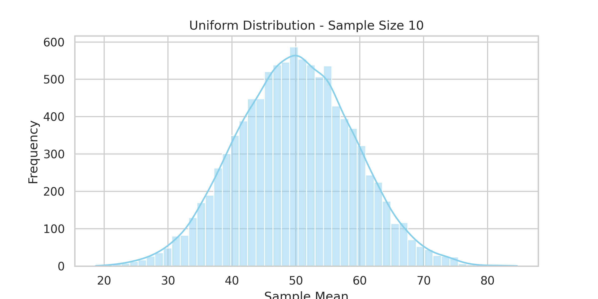
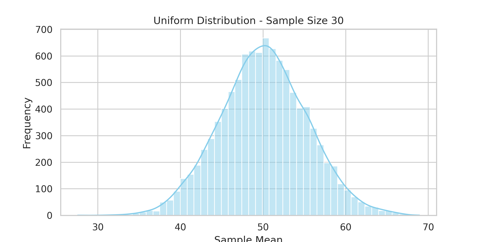
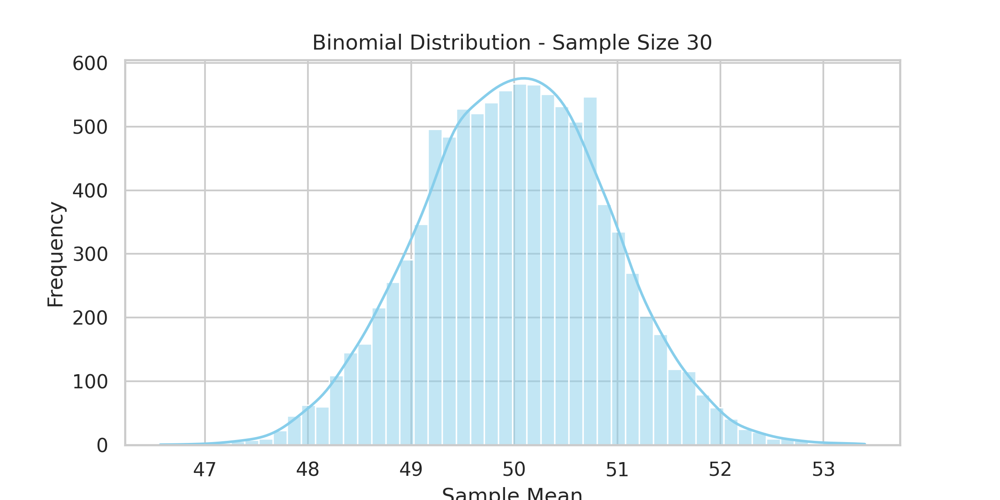

# Problem 1: Exploring the Central Limit Theorem through Simulations

## 🎯 Motivation

The **Central Limit Theorem (CLT)** is a fundamental concept in probability and statistics. It states that, regardless of the population's original distribution, the sampling distribution of the **sample mean** will approximate a **normal distribution** as the **sample size increases**.

---

## 🧪 Simulating Sampling Distributions

We'll generate large datasets for these distributions:
- Uniform
- Exponential
- Binomial

Each dataset contains 100,000 values.

---

## 📊 Sampling and Histogram Visualization

We'll:
- Draw 10,000 samples for each sample size (5, 10, 30, 50)
- Compute the sample mean
- Plot histograms to see convergence toward normality

---

## 📸 Generated Histograms

### ✅ Uniform Distribution  
  

### ✅ Exponential Distribution  

### ✅ Binomial Distribution  

---

## 🌍 Visual Comparison at Sample Size = 30

| Uniform | Exponential | Binomial |
|--------|-------------|----------|
|  |  |  |

---

## ✅ Summary

This simulation visually confirms that regardless of the original distribution, the **sampling mean** distribution becomes approximately **normal** with sufficient sample size, validating the Central Limit Theorem.

[visit my colab](https://colab.research.google.com/drive/1tNL1Uht_NlbxpEmx-IhVyRU4iF8HjaGN?usp=sharing)

