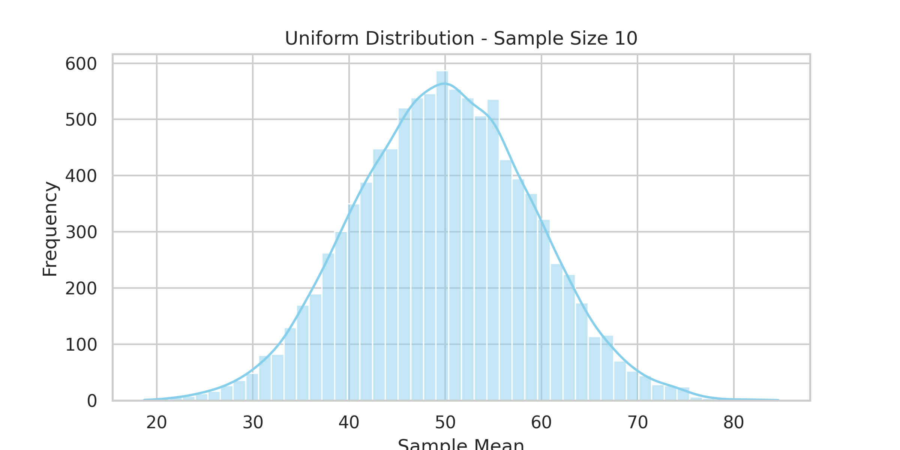
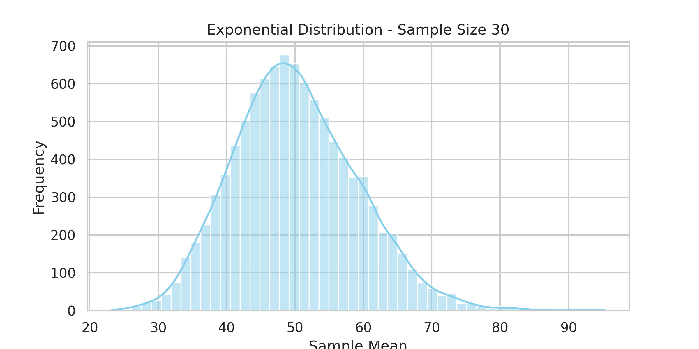

# Problem 1: Exploring the Central Limit Theorem through Simulations

## 🎯 Motivation

The **Central Limit Theorem (CLT)** is a fundamental concept in probability and statistics. It states that, regardless of the population's original distribution, the sampling distribution of the **sample mean** will approximate a **normal distribution** as the **sample size increases**.

---

## 🧪 Simulating Sampling Distributions

We'll generate large datasets for these distributions:

* Uniform
* Exponential
* Binomial

Each dataset contains 100,000 values.

---

## 📊 Sampling and Histogram Visualization

We'll:

* Draw 10,000 samples for each sample size (5, 10, 30, 50)
* Compute the sample mean
* Plot histograms to see convergence toward normality

---

## 📸 Generated Histograms

### ✅ Uniform Distribution

```python
import numpy as np
import matplotlib.pyplot as plt

# Uniform n=10
data = np.random.uniform(0, 1, 100000)
sample_means = [np.mean(np.random.choice(data, 10)) for _ in range(10000)]
plt.hist(sample_means, bins=50, density=True, color='skyblue', edgecolor='black')
plt.title('Sampling Distribution (Uniform, n=10)')
plt.xlabel('Sample Mean')
plt.ylabel('Density')
plt.tight_layout()
plt.savefig('CLT_uniform_n10-4.png', dpi=300)
plt.show()
```

  

```python
# Uniform n=30
sample_means = [np.mean(np.random.choice(data, 30)) for _ in range(10000)]
plt.hist(sample_means, bins=50, density=True, color='limegreen', edgecolor='black')
plt.title('Sampling Distribution (Uniform, n=30)')
plt.xlabel('Sample Mean')
plt.ylabel('Density')
plt.tight_layout()
plt.savefig('CLT_uniform_n30-4.png', dpi=300)
plt.show()
```


### ✅ Exponential Distribution

```python
# Exponential n=30
data = np.random.exponential(scale=1.0, size=100000)
sample_means = [np.mean(np.random.choice(data, 30)) for _ in range(10000)]
plt.hist(sample_means, bins=50, density=True, color='darkorange', edgecolor='black')
plt.title('Sampling Distribution (Exponential, n=30)')
plt.xlabel('Sample Mean')
plt.ylabel('Density')
plt.tight_layout()
plt.savefig('CLT_exponential_n30-3.png', dpi=300)
plt.show()
```



### ✅ Binomial Distribution

```python
# Binomial n=30
data = np.random.binomial(n=10, p=0.5, size=100000)
sample_means = [np.mean(np.random.choice(data, 30)) for _ in range(10000)]
plt.hist(sample_means, bins=50, density=True, color='indianred', edgecolor='black')
plt.title('Sampling Distribution (Binomial, n=30)')
plt.xlabel('Sample Mean')
plt.ylabel('Density')
plt.tight_layout()
plt.savefig('CLT_binomial_n30-3.png', dpi=300)
plt.show()
```


---

## 🌍 Visual Comparison at Sample Size = 30

| Uniform                                        | Exponential                                        | Binomial                                        |
| ---------------------------------------------- | -------------------------------------------------- | ----------------------------------------------- |
|  |  |  |

---

## ✅ Summary

This simulation visually confirms that regardless of the original distribution, the **sampling mean** distribution becomes approximately **normal** with sufficient sample size, validating the Central Limit Theorem.

[visit my colab](https://colab.research.google.com/drive/1tNL1Uht_NlbxpEmx-IhVyRU4iF8HjaGN?usp=sharing)
