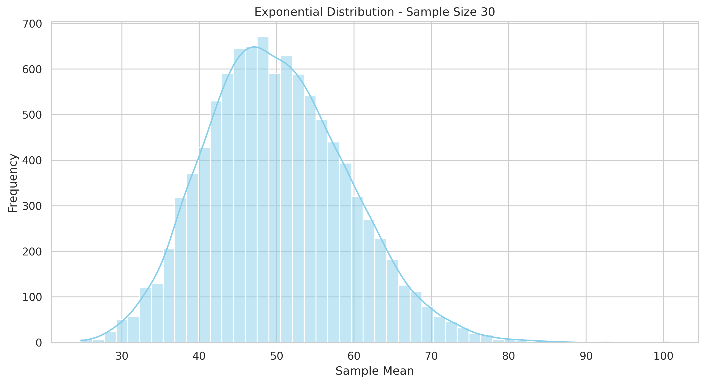
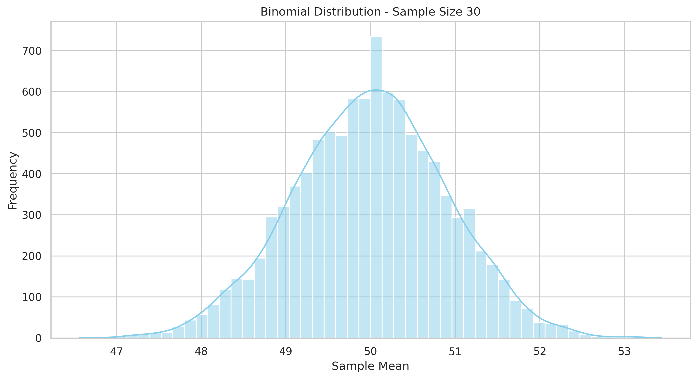

# Problem 1: Exploring the Central Limit Theorem through Simulations

## 🌟 Motivation

The **Central Limit Theorem (CLT)** is a fundamental concept in probability and statistics. It states that, regardless of the population's original distribution, the sampling distribution of the **sample mean** will approximate a **normal distribution** as the **sample size increases**.

This simulation explores the CLT using Python to demonstrate how the shape of the original distribution and the sample size affect convergence to normality.

---

## 🧪 1. Simulating Sampling Distributions

We will generate data from three different population distributions:

* `Uniform distribution`
* `Exponential distribution`
* `Binomial distribution`

Each population will contain **100,000 random values** to ensure a large base for sampling.

---

## 📊 2. Sampling and Visualization

We'll sample from each population using different sample sizes:

* Sample sizes: `[5, 10, 30, 50]`
* For each size, we'll draw **10,000 samples**
* For each sample, compute the **mean**
* Then, plot the **histogram of the sample means**

Libraries to use:

```python
import numpy as np
import matplotlib.pyplot as plt
import seaborn as sns
from google.colab import files  # for download in Colab
```

---

## 🔍 3. Parameter Exploration

We'll analyze:

* How skewness and kurtosis of the population distribution affect the speed of convergence.
* How variance influences the spread of the sampling distribution.

---

## 🔠 4. Practical Applications

The CLT is essential in real-world contexts such as:

* **Polling**: Estimating population opinion from small samples.
* **Manufacturing**: Quality control through average defect rates.
* **Finance**: Modeling aggregated risk under normality assumptions.

---

## 📚 Definitions with Examples

| Term                         | Definition                                            | Example                                            |
| ---------------------------- | ----------------------------------------------------- | -------------------------------------------------- |
| **Population**               | Entire group of interest                              | All university students                            |
| **Sample**                   | Subset of population for analysis                     | 100 randomly selected students                     |
| **Sample Size**              | Number of observations in a sample                    | 30 students                                        |
| **Sampling Distribution**    | Distribution of sample statistics from many samples   | Distribution of 1000 sample means                  |
| **Sample Mean**              | Average of the sample values                          | Average GPA of selected students                   |
| **Convergence to Normality** | As sample size ↑, sampling mean → normal distribution | Average income from many samples looks bell-shaped |
| **Skewness**                 | Asymmetry of a distribution                           | Income is right-skewed                             |
| **Kurtosis**                 | "Tailedness" of a distribution                        | Stock returns have high kurtosis                   |
| **Variance**                 | Spread of data values from the mean                   | Test scores [40, 80, 120] → high variance         |
| **Standard Deviation**       | Square root of variance                               | Height SD = 3 inches                               |
| **Normal Distribution**      | Bell-shaped distribution defined by mean and std      | IQ scores, heights                                 |

---

## 📈 Interpretation & Discussion

### ➔ Observations:

* `Uniform`: Even small samples (n=10) show near-normality due to symmetry.
* `Exponential`: Requires larger n (≥ 30) for normal approximation due to skewness.
* `Binomial`: Discrete but bounded, converges well for moderate n.

### ➔ Variance Impact:

* Higher original variance → wider sampling distribution.
* As n increases, spread decreases ~ 1/√n.

### ➔ Convergence Insight:

This simulation visually confirms the CLT: regardless of original distribution, the sampling mean distribution becomes approximately normal with sufficient sample size.

---

## 🗓️ Python Implementation

```python
# 🌟 CLT Simulation Code

import numpy as np
import matplotlib.pyplot as plt
import seaborn as sns
from google.colab import files

# Styling
sns.set(style="whitegrid")
plt.rcParams["figure.figsize"] = (12, 6)

# Function to simulate, save & download
def simulate_and_save(population, sample_sizes, dist_name=""):
    for size in sample_sizes:
        sample_means = []
        for _ in range(10000):
            sample = np.random.choice(population, size=size)
            sample_means.append(np.mean(sample))

        plt.figure()
        sns.histplot(sample_means, kde=True, bins=50, color="skyblue")
        plt.title(f"{dist_name} Distribution - Sample Size {size}")
        plt.xlabel("Sample Mean")
        plt.ylabel("Frequency")

        filename = f"{dist_name.lower()}_n{size}.png"
        plt.savefig(filename, dpi=300, bbox_inches='tight')
        plt.show()
        files.download(filename)
```

```python
# Create populations
N = 100_000
uniform_pop = np.random.uniform(0, 100, size=N)
exponential_pop = np.random.exponential(scale=50, size=N)
binomial_pop = np.random.binomial(n=100, p=0.5, size=N)

# Simulate & download selected graphs
simulate_and_save(uniform_pop, [10, 30], dist_name="Uniform")
simulate_and_save(exponential_pop, [30], dist_name="Exponential")
simulate_and_save(binomial_pop, [30], dist_name="Binomial")
```

---

## 📊 Generated Histograms

### 📈 Uniform Distribution
  


### 📈 Exponential Distribution


### 📈 Binomial Distribution


---

### 🌍 Visual Comparison at Sample Size = 30

| Uniform | Exponential | Binomial |
|--------|-------------|----------|
|  |  |  |

---

## ✅ Summary

This simulation project demonstrated the Central Limit Theorem using Python. Through repeated sampling from various population distributions (uniform, exponential, binomial), we observed that the distribution of the sample mean converges to a normal distribution as sample size increases.

[visit my colab](https://colab.research.google.com/drive/1tNL1Uht_NlbxpEmx-IhVyRU4iF8HjaGN?usp=sharing)
