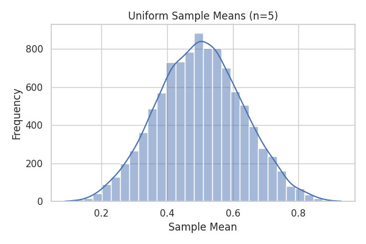
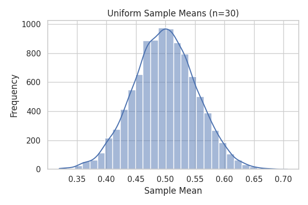
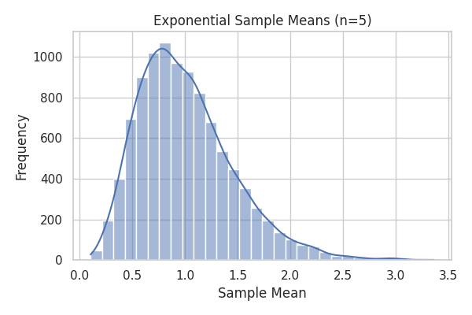
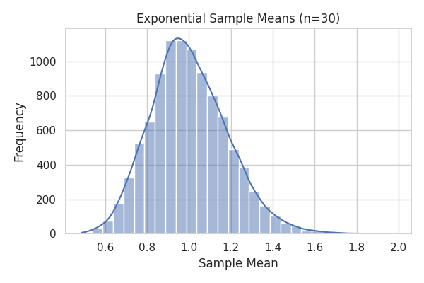
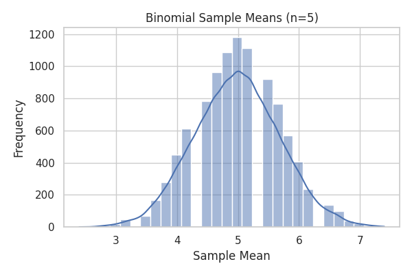
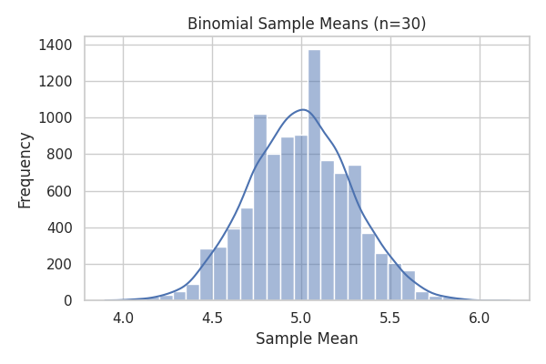

# Problem 1: Exploring the Central Limit Theorem through Simulations

## 🎯 Motivation

The **Central Limit Theorem (CLT)** states that as sample size increases, the distribution of sample means approaches a normal distribution regardless of the original population's shape. In this project, we simulate and visualize this convergence using three distributions.

---

## 📚 Definitions

- **Population**: The entire group we are interested in.
- **Sample**: A subset of the population.
- **Sample Size (n)**: The number of elements in a sample.
- **Sample Mean**: The average of sample elements.
- **Sampling Distribution**: The distribution of the sample mean over many samples.
- **Convergence to Normality**: The tendency of the sampling distribution to become normal as sample size increases.

---

## 🧪 Simulation Code (Used in Google Colab)

```python
import numpy as np
import matplotlib.pyplot as plt
import seaborn as sns
import os

sns.set(style="whitegrid")

# Ortak parametreler
sample_sizes = [5, 30]
num_samples = 10000
image_dir = "images"
os.makedirs(image_dir, exist_ok=True)

# --- UNIFORM DISTRIBUTION ---
print("Generating plots for Uniform Distribution...")
pop_uniform = np.random.uniform(0, 1, size=100000)
for size in sample_sizes:
    means = [np.mean(np.random.choice(pop_uniform, size=size)) for _ in range(num_samples)]
    plt.figure(figsize=(6, 4))
    sns.histplot(means, kde=True, bins=30)
    plt.title(f"Uniform Sample Means (n={size})")
    plt.xlabel("Sample Mean")
    plt.ylabel("Frequency")
    plt.tight_layout()
    plt.savefig(f"{image_dir}/uniform_{size}.png")
    plt.close()

# --- EXPONENTIAL DISTRIBUTION ---
print("Generating plots for Exponential Distribution...")
pop_exp = np.random.exponential(scale=1.0, size=100000)
for size in sample_sizes:
    means = [np.mean(np.random.choice(pop_exp, size=size)) for _ in range(num_samples)]
    plt.figure(figsize=(6, 4))
    sns.histplot(means, kde=True, bins=30)
    plt.title(f"Exponential Sample Means (n={size})")
    plt.xlabel("Sample Mean")
    plt.ylabel("Frequency")
    plt.tight_layout()
    plt.savefig(f"{image_dir}/exponential_{size}.png")
    plt.close()

# --- BINOMIAL DISTRIBUTION ---
print("Generating plots for Binomial Distribution...")
pop_binom = np.random.binomial(n=10, p=0.5, size=100000)
for size in sample_sizes:
    means = [np.mean(np.random.choice(pop_binom, size=size)) for _ in range(num_samples)]
    plt.figure(figsize=(6, 4))
    sns.histplot(means, kde=True, bins=30)
    plt.title(f"Binomial Sample Means (n={size})")
    plt.xlabel("Sample Mean")
    plt.ylabel("Frequency")
    plt.tight_layout()
    plt.savefig(f"{image_dir}/binomial_{size}.png")
    plt.close()

print("✅ Done! Only 6 images were created (2 per distribution).")
```

---

## 📊 Visualization Results

### Uniform Distribution
- **n = 5**  
  

- **n = 30**  
  

### Exponential Distribution
- **n = 5**  
  

- **n = 30**  
  

### Binomial Distribution
- **n = 5**  
  

- **n = 30**  
  

---

## 🔍 Observations

- When **n = 5**, distributions (especially exponential) are skewed and not yet normal.
- When **n = 30**, distributions become approximately bell-shaped.
- CLT works even with non-normal populations like exponential, given a large enough sample size.

---

## ✅ Conclusion

This experiment confirms the Central Limit Theorem. The sampling distribution of the mean tends toward normality as the sample size increases, regardless of the original distribution.

---
[visit my colab](https://colab.research.google.com/drive/1o7-Rx8dwySeraN4pMpJFN8oBfSBVCTQz?usp=sharing)