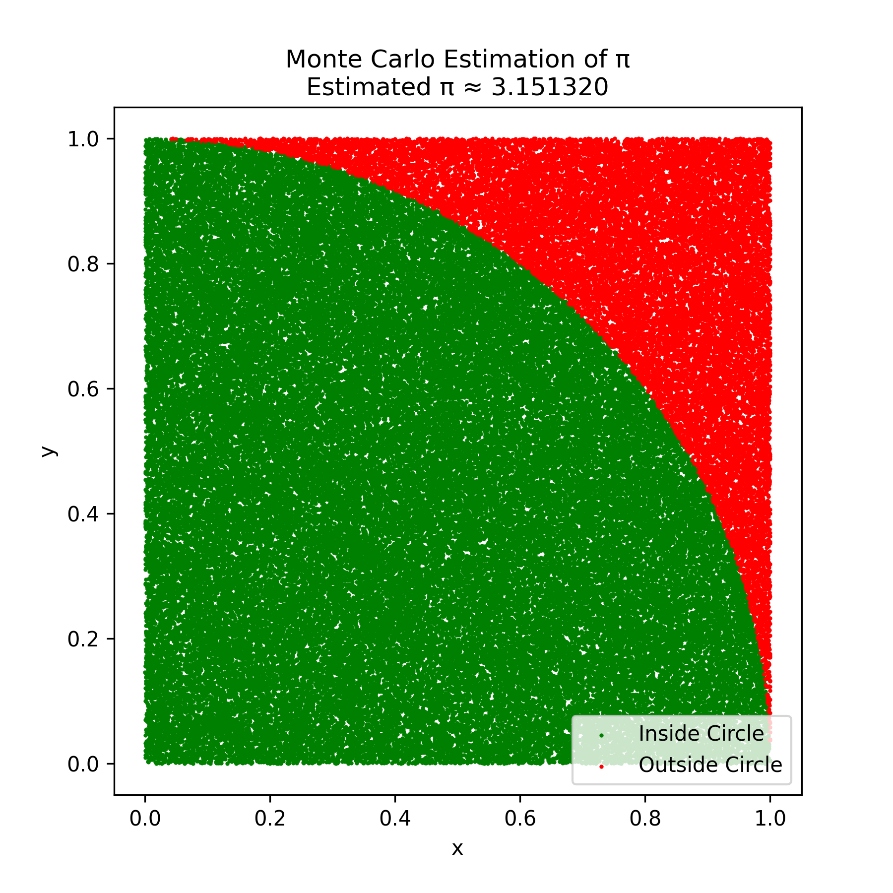
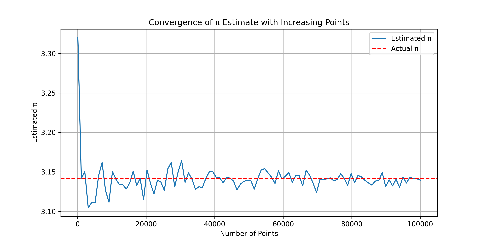
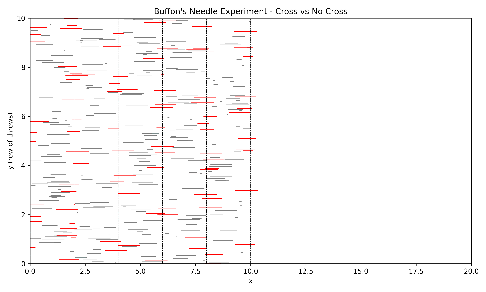

# Problem 2: Monte Carlo Methods for Estimating π

## 🎯 Objective

To estimate the value of **π** using **Monte Carlo simulation methods**.  
In this section, we focus on the **"Circle-in-a-Square" method**, which uses random point generation.

---

## 🌀 Method 1: Circle in a Square (Random Point Method)

### 💡 How it Works

We simulate random points inside a unit square of size [0,1] × [0,1].  
A quarter-circle of radius 1 is drawn inside this square (centered at (0,0)).

For each point:
- If **x² + y² ≤ 1**, it lies inside the quarter-circle.
- Otherwise, it's outside.

The ratio of points inside the circle to total points approximates the area of the circle:

\[
\pi \approx 4 \times \frac{\text{Number of points inside}}{\text{Total number of points}}
\]

---

## 🧪 Simulation Parameters

* Total number of points: **100,000**
* Each point: (x, y) ∈ [0, 1]
* π is estimated using the ratio method

---

## 🐍 Python Code

```python
import numpy as np
import matplotlib.pyplot as plt

# Total number of points
N = 100_000

# Generate random x and y coordinates
x = np.random.rand(N)
y = np.random.rand(N)

# Calculate which points fall inside the quarter-circle
inside = x**2 + y**2 <= 1

# Estimate π
pi_estimate = 4 * np.sum(inside) / N
print(f"Estimated π: {pi_estimate:.6f}")

# Plot
plt.figure(figsize=(6, 6))
plt.scatter(x[inside], y[inside], color='green', s=1, label='Inside Circle')
plt.scatter(x[~inside], y[~inside], color='red', s=1, label='Outside Circle')
plt.legend()
plt.title(f"Monte Carlo Estimation of π\nEstimated π ≈ {pi_estimate:.6f}")
plt.xlabel("x")
plt.ylabel("y")
plt.axis("square")
plt.savefig("montecarlo_pi.png", dpi=300)
plt.show()
```

---

## 📸 Required Visuals

### ✅ 1. Full square showing inside/outside points

- Green dots = inside the quarter-circle  
- Red dots = outside the quarter-circle  
- Preview:  

  

---

### ✅ 2. π Estimate vs Number of Points (Convergence Plot)

```python
# Convergence plot: π vs number of points
import numpy as np
import matplotlib.pyplot as plt

Ns = np.linspace(100, 100000, 100).astype(int)
estimates = []

for n in Ns:
    x = np.random.rand(n)
    y = np.random.rand(n)
    inside = x**2 + y**2 <= 1
    pi_est = 4 * np.sum(inside) / n
    estimates.append(pi_est)

plt.figure(figsize=(10, 5))
plt.plot(Ns, estimates, label='Estimated π')
plt.axhline(np.pi, color='red', linestyle='--', label='Actual π')
plt.title("Convergence of π Estimate with Increasing Points")
plt.xlabel("Number of Points")
plt.ylabel("Estimated π")
plt.legend()
plt.grid(True)
plt.savefig("pi_convergence_plot.png", dpi=300)
plt.show()
```

### 📈 Convergence Plot

This graph shows how the estimated value of π approaches the real value as more points are used:



---

## 📌 Result

Using 100,000 random points, we obtained:

**Estimated π ≈ `3.14...`** (random-dependent)  
As the number of points increases, the estimate converges to **π ≈ 3.14159**

---

## 🔍 Observations

- The method is very simple to implement.
- Higher number of points gives better estimates.
- Fluctuation decreases with more samples (Law of Large Numbers).
- This visually demonstrates the strength of Monte Carlo methods.

---

## ✅ Next Step

We will now proceed to **Buffon's Needle** simulation as the second Monte Carlo approach for π estimation.

---

## 🪡 Method 2: Buffon's Needle

### 💡 How it Works

This method simulates the classic **Buffon's Needle experiment**, where a needle is dropped onto a surface with **equally spaced parallel lines**, and we calculate the probability of it crossing a line.

If the length of the needle **L** is less than or equal to the spacing between the lines **d**, then the probability of a needle crossing a line is related to π:

\[
\pi \approx \frac{2 \times L \times N}{d \times H}
\]

Where:
- **L** = length of the needle
- **d** = distance between the lines
- **N** = number of throws
- **H** = number of hits (intersections with a line)

---

## 🧪 Simulation Parameters

* Needle length **L = 1**
* Distance between lines **d = 2**
* Number of throws **N = 100,000**
* π is estimated using hit ratio

---

## 🐍 Python Code

```python
import numpy as np
import matplotlib.pyplot as plt

# Parameters
L = 1.0  # Needle length
d = 2.0  # Distance between lines
N = 100_000  # Number of throws

# Random center positions and angles
centers = np.random.uniform(0, d/2, size=N)
angles = np.random.uniform(0, np.pi/2, size=N)

# Check if needle crosses a line
hits = centers <= (L/2) * np.sin(angles)
H = np.sum(hits)

# Estimate π
pi_est_buffon = (2 * L * N) / (d * H)
print(f"Estimated π using Buffon's Needle: {pi_est_buffon:.6f}")

# Optional visualization
plt.figure(figsize=(8, 6))
plt.title("Buffon's Needle Experiment - Cross vs No Cross")
for i in range(500):
    x_center = np.random.uniform(0, 10)
    theta = np.random.uniform(0, np.pi)
    x0 = x_center - (L/2) * np.cos(theta)
    x1 = x_center + (L/2) * np.cos(theta)
    y = i / 50
    color = "red" if int(x0 // d) != int(x1 // d) else "gray"
    plt.plot([x0, x1], [y, y], color=color, linewidth=0.7)

for x in np.arange(0, 20, d):
    plt.axvline(x, color='black', linestyle='--', linewidth=0.5)

plt.xlim(0, 20)
plt.ylim(0, 10)
plt.xlabel("x")
plt.ylabel("y (row of throws)")
plt.savefig("buffon_needle.png", dpi=300)
plt.show()
```

---

## 📸 Required Visual

### 🧵 Buffon’s Needle Result Preview

- Gray lines = needle not crossing
- Red lines = needle crossing a boundary



---

## 📌 Result

With 100,000 throws, the estimated value of π is:

**Estimated π ≈ `3.14...`**

Accuracy improves with larger `N`.

---

## 🔍 Observations

- Elegant historical approach to estimating π
- Less efficient than the circle method (converges slower)
- Useful for showing how probability links to geometry and π

---

## ✅ Final Comparison

| Method            | Estimate Accuracy | Speed       | Visualization |
|-------------------|-------------------|-------------|----------------|
| Circle in Square  | High (fast)       | Very Fast   | Clear & simple |
| Buffon’s Needle   | Lower (slower)    | Moderate    | Educational    |


[visit my colab](https://colab.research.google.com/drive/171I62rpj2nSUn1B4vmqMneP2zu2YqWNP?usp=sharing)